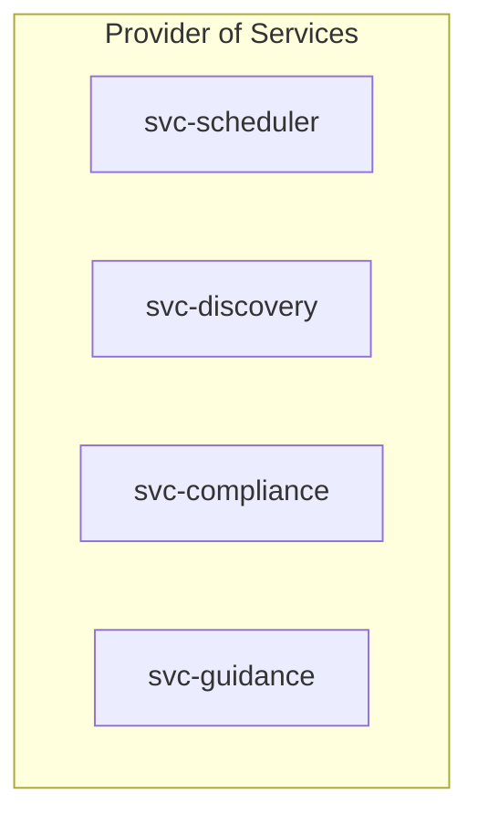
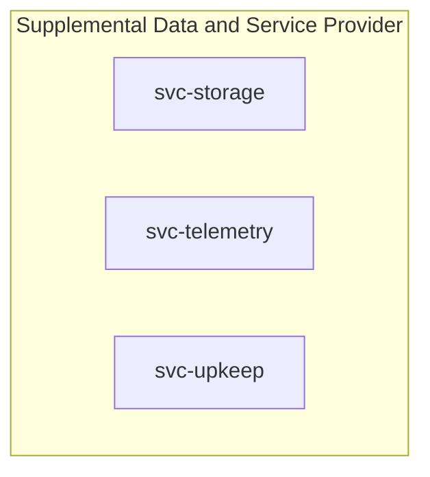
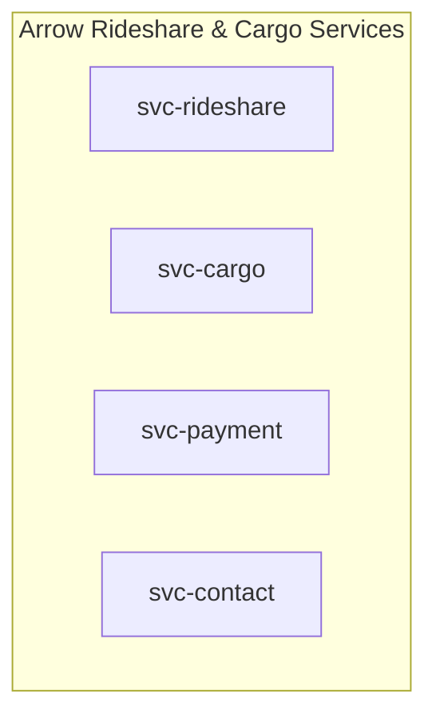
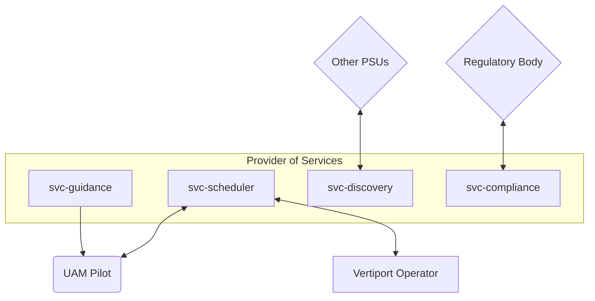
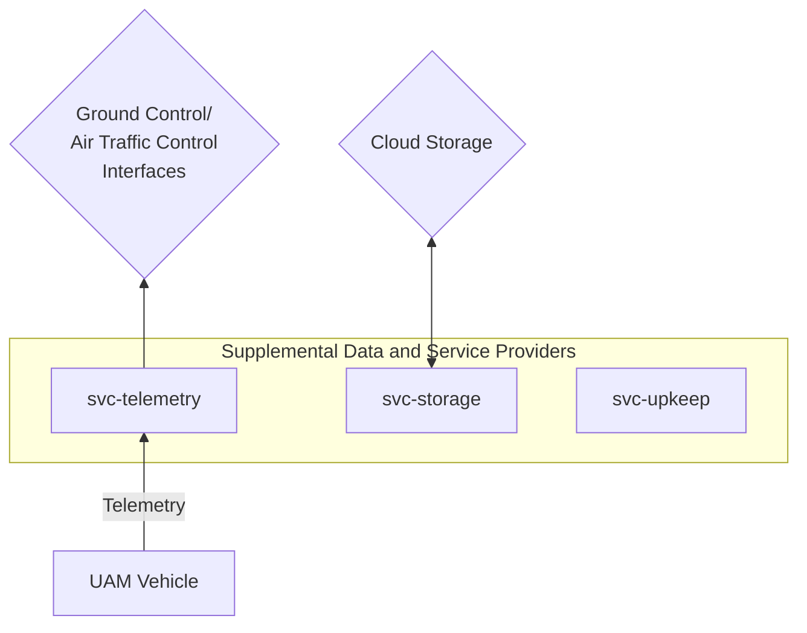
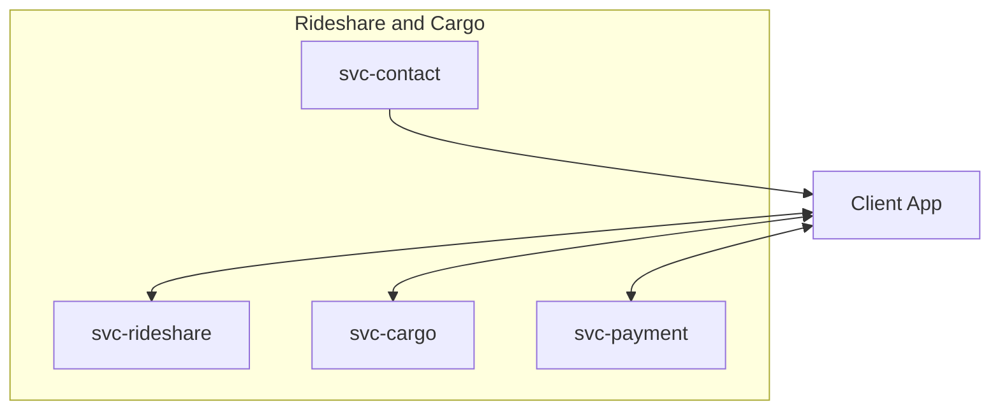

# Concept of Operations - Software Services

Item | Value
--- | ---
Maintainer(s) | @arrow-air/services

## 1.0 Project Description

#### 1.0.1 Background

The electric vertical takeoff and landing (eVTOL) aircraft is a radical breakthrough in rapid, zero-emission, point-to-point travel. In an urban environment currently stifled by congested roadways and inefficient routing, a well populated eVTOL network stands to completely disrupt human mobility. Urban aerial mobility (UAM) markets are expected to expand dramatically within the next few years, with initial flights expected as early as 2026.

VTOL vertipads boast a compact terrestrial footprint, allowing dense distribution throughout the urban and suburban environment. Passengers may soon take flight from a local rooftop, parking lot, park, courtyard, pier - or even a backyard. 

Proliferation of accessible vertiports will open the skies to a vast and motley assortment of aircraft: public transit ferries, independent rideshares, corporate charters, cargo deliveries by the dozen, municipal fleets, medical drones, construction surveyors, vigilant security patrols, and hundreds more. While use cases stretch as far as the imagination, airspace and vertiport resources are far more limited.

Core to the vision of advanced aerial mobility is an open software ecosystem enabling these myriad aerial actors to share ports and skies safely. Systems for autonomous air traffic management, open data exchange, and automated regulatory compliance will soon be a necessity to ensure fast, legal, and secure access to airspace. Also fundamental to this dream is concept of interoperability: that aircraft from numerous manufacturers, countries, and service providers may share airspace on the same cooperative network.

This document proposes an open software architecture to support dynamic airspace management and data exchange between Urban Aerial Mobility (UAM) actors. The proposed system undertakes the responsibilities of **Provider of Services to UAM (PSU)** and **Provider of Supplemental Data and Services (SDSP)** as outlined by the [NASA UAM Airspace Research Roadmap](https://ntrs.nasa.gov/citations/20210019876). It also proposes use cases in the form of rideshare and cargo services.

In the role of PSU, this architecture enables operators safe and secure access to airspace, manages contingencies, complies with the data exchange systems of regulatory bodies, and allows interoperability with other service providers. In the role of SDSP, the architecture offers automated maintenance scheduling, certification monitoring, telemetry broadcasts, and secure storage. Arrow's client-facing services support rideshare and cargo operations, exposing an API for customer applications to request journeys between vertiports with traditional and alternative payment options.

#### 1.0.2 Assumptions and Constraints
This architecture acknowledges the existence of other Providers of Service (PSUs), that vertiports and aircraft will be owned and operated by various companies and individuals, and that compliance with civil aviation authority differs from region to region.

This architecture intends to abide by standardized protocols established by NASA, EASA, and other agencies to ensure interoperability between UAM actors and systems.

### 1.1 Overview of the Envisioned System

#### 1.1.1 Overview

The Arrow Software Services are broken into several domains of responsibility.

**Provider of Services (PSU)** elements enable UAM operators to access airspace legally, safely, and securely. 

> "A PSU is an entity that provides services to the UAM Operator to help them meet UAM operational requirements that enable safe, efficient, and secure use of the airspace.   Multiple PSUs employed by different operators will be part of a network and subject to interoperability requirements.  The PSU is the trusted source for some of the traditional [Air Navigation Service Provider (ANSP)] services, such as distribution of notifications, confirmation of flight intent, and confirmation of authorized access to airspace." - [UAM Airspace Research Roadmap](https://ntrs.nasa.gov/citations/20210019876)

**Supplemental Data and Services Provider (SDSP)** elements provide *supplemental* or non-critical services for UAM operations.

> "Supplemental Data and Services Provider (SDSP): UAM Operators and PSUs use Supplemental Data Service Providers (SDSPs) to access supporting data including, but not limited to, terrain, obstacle, aerodrome availability, and weather. SDSPs may be accessed via the PSU network or directly by UAM operators." - [UAM Airspace Research Roadmap](https://ntrs.nasa.gov/citations/20210019876)

**Rideshare and Cargo Services** elements are client-facing and not safety-critical.

Description of the individual services is covered in section 3.2.

## 2.0 Documents
### 2.1 Applicable Resources

| Resource | Type |
| --- | --- |
| [UAM Airspace Research Roadmap](https://ntrs.nasa.gov/citations/20210019876) | Website
| [NASA Air Traffic Management (ATM-X)](https://www.nasa.gov/aeroresearch/programs/aosp/atm-x/atm-x-project-description) | Website
| [NASA Extensible Traffic Management (xTM) Research ](https://ntrs.nasa.gov/citations/20210025112) | Website

## 3.0 Description of Envisioned System

### 3.1 Needs, Goals and Objectives of Envisioned System
Each service in this architecture is associated with a set of requirements.

Each service has its own set of documents which should be referred to for more detailed information. These documents include:
- Concept of Operations (CONOPS)
- Software Design Document (SDD)
- Interface Control Document (ICD)
- Verification and Validation (V&V) Document

A set of user stories for rideshare and cargo operations are currently tracked on the [Arrow Google Drive](https://docs.google.com/spreadsheets/d/1Ad238NAEj6QUzgsjPTRRFJy6NiQVQt2e7affwVVDAFo/edit?usp=sharing).

### 3.2 Overview of System and Key Elements

#### Provider of Services (PSU) Elements

These services enable UAM operators to access airspace legally, safely, and securely.

Service | Responsibilities
--- | ---
`svc-scheduler` | Airspace management Vertiport scheduling Flight plan bookkeeping Fleet routing optimization
`svc-discovery` | Interaction with other PSUs Adheres to standardized PSU interfaces
`svc-compliance` | Notifications, flight restrictions, authorization approvals from local authority Automated dispatch of flight plans and release requests to local authority Complies with regulatory file formats such as FIDXP*
`svc-guidance` | Noncompulsory flight path guidance Importance increases with number of aerial actors

* FAA-Industry Data Exchange Protocol

#### Supplemental Data and Service Provider (SDSP) Elements

These elements provide *supplemental* (not safety critical) services for UAM operations.

Service | Responsibilities
--- | ---
`svc-storage` | Abstracted storage interface for the other services Logs, maintenance records, certification records, and so on
`svc-telemetry` | Receives and stores live vehicle telemetry* Rebroadcasts to ground control/air traffic control tools and other listeners
`svc-upkeep` | Monitor expiration of vehicle and component certifications Preemptively schedule flights for maintenance

* May qualify as a PSU element.
#### Rideshare and Cargo Services

These are client-facing services which expose an API. These are not safety-critical.

Service | Responsibilities
--- | ---
`svc-rideshare` | The public API for passengers to request rides through Arrow Services 
`svc-cargo` | The public API for clients to request cargo transport through Arrow Services
`svc-payment` | Payment processing, accepting traditional payments and cryptocurrencies.
`svc-contact` | In all other parts of the system, a customer is an integer ID This service has sole access to customer information, the interface to issue notifications to a client

### 3.3 External Interfaces
This section describes the interfaces of the system with any other systems that are external to the project. Interfaces *between* services are not shown in these diagrams.

#### PSU Interfaces

`svc-scheduler`:
- Reports schedules to Vertiport Operators and Pilots in Control (PIC).
- Vertiport Operators and Pilots may make requests to the scheduler to delay or accelerate a departure, cancel a flight, or initiate emergency operations.

`svc-compliance`:
- Information exchanged with civil aviation authorities may include notifications, confirmation of flight authorization, flight restrictions, charted routes, and Special Use/Activity Airspaces (SAA).
- FAA-Industry Data Exchange Protocol (FIDXP) is an interface that allows UAM operators to obtain information from the United States' [National Airspace System (NAS) Data Exchange](https://www.faa.gov/air_traffic/nas/).
- Data exchange formats may differ based on region.

`svc-discovery`:
- Other PSUs may need to coordinate with this PSU in scheduling flights to vertiports.
- Example: proprietary PSU schedules a flight from a private vertiport to a public vertiport managed by this PSU.
- Example: regional instances of *svc-scheduler* coordinate to transfer stewardship of an aircraft which is departing one PSU's region into another PSU's region.

`svc-guidance`:
- Calculating flight paths will be increasingly important as the number of simultaneous airborne UAM vehicles increases.
- Flight paths are chosen at the discretion of the Pilot in Control (PIC). Suggested flight paths from this service should be taken into consideration when planning the general route.

#### SDSP Interfaces

`svc-telemetry`:
- UAM vehicles broadcast telemetry, which is processed and stored by this service.
- This service may re-broadcast telemetry to clients such as Air Traffic Control (ATC) software.

`svc-storage`:
- Links to multiple storage solutions, paired with specific types of data.
- Blockchain storage provides defensive "immutable" record keeping for certifications, maintenance records, previous flight plans, FAA confirmations.
- SQL databases for CRUD operations on flight plans
- Storage may be local to the services or on a cloud server.

#### Rideshare and Cargo Interfaces

`svc-rideshare` & `svc-cargo`:
- APIs for clients to request flights. Separated from airspace management (`svc-scheduler`).

`svc-payment`:
- API for client apps to make payments in exchange for services.

`svc-contact`:
- Access to customer SMS, Email, Push Notifications
### 3.4 Proposed Capabilities

Scenario | Description
---- | ----
Private Charter | Clients* can register a flight plan directly with the Arrow PSU. Clients submit a flight plan specifying an aircraft, the departure vertiport, the arrival vertiport, the flight manifest, and the planned departure date and time.
Rideshare | Clients request flights through a software API, website, or mobile app. `svc-rideshare` handles the customer interaction, and forwards the request to the PSU domain. In this case, a client only provide a departure time, departure vertiport, and destination vertiport.
Cargo | In the envisioned rideshare system, clients may request flights through a software API, website, or mobile app. The flight request is handled by the PSU domain of the Services ecosystem. In this case, clients provide a departure time, departure vertiport, destination vertiport, and the approximate weight of cargo. They may also specify if the trip will be recurring for planned deliveries.

* Clients include individuals, companies, and automated processes

In all of the above scenarios, the `svc-scheduler` in the Arrow PSU receives a request for a new flight and determines if that flight can be accommodated. It must take into account numerous factors such as vertiport schedules, available aircraft, weather, and emergency conditions.

In the rideshare scenario, aircraft have a known flight schedule and number of seats. `svc-scheduler` will assign riders to an aircraft with available seats, with minor adjustments to departure times if necessary and possible. Similarly in the cargo scenario, the `svc-scheduler` will assign cargo to an available cargo aircraft.

In some cases, a flight plan request can be accommodated by simply swapping aircraft or lightly postponing a flight's departure time. `svc-scheduler`'s fleet routing optimization will perform these changes where allowed.

In cases where the journey cannot be accommodated, alternatives should be recommended. UAM operators (pilots, vertiport operators) may issue commands directly to the `svc-scheduler` to cancel or modify a plan. This may occur mid-flight, such as in a medical emergency, or on a vertiport pad, such as when a vehicle fails pre-flight checks. These events will trigger a fleet optimization from `svc-scheduler` to accommodate the shift in plans.

### 3.5 Modes of Operations

Modes of operation correspond with a general fleet routing behavior. They indicate the current goal of flight operations.

Mode | Description
--- | ---
Nominal | New flight plans may be created if they can be accommodated. Optimize rideshare flights to maximize passengers per aircraft. Optimize flight graph to accommodate more flights per hour. A buzzing flight graph maximizing motion.
Wind Down | No new flights plans are accepted (save for municipal and emergency flights) for a given time frame. Confirmed flight plans execute as previously planned. Can still add new rideshare passengers to existing flight plans. May occur daily to close flight operations if services are not 24/7. "Chokes" a flight graph to reduce the level of activity.
Emergency No-Fly | All aerial operations must cease at earliest opportunity, even if arrival vertiport is different than planned. Improvised landing zones are authorized at this stage to handle vertiport overflow. All live aircraft in the flight graph immediately "seek cover" at the nearest safe haven.

Fleet routing can also be impacted by other factors such as vertiport redirect orders, restricted (or "special use") airspaces, and emergency flights taking precedence. These factors may apply to multiple modes of operation. In some cases they are intentionally ignored, such as the case of an emergency no-fly scenario.

## 4.0 Operational Scenarios, Use Cases and/or Design Reference Missions

See "Modes of Operation" (section 3.5).

Mode | Scenario
--- | ---
Nominal | Nominal flight operations
Wind Down | Ending daily flight operations Overtaxed flight graph - intense delays, many hovering aircraft waiting for landing clearance
Emergency No-Fly | Terrorism (including cyber attacks) Sudden weather changes, such as a tornado touchdown

The current mode can be conveyed over radio or cellular channels in the event of a critical outage of software services (electrical failures, solar flares, etc.). Such an event should initiate "Wind Down" mode at minimum, and each pilot and UAM operator will follow a manual procedure for vertiport access and selection of improvised landing sites, if necessary.

### 4.1 Nominal & Off-Nominal Conditions

Nominal and off-nominal conditions will be addressed by service-level requirements, which will link up to high level requirements. These documents are still being developed.

Existing documents in this realm include:
- [Services User Stories](https://docs.google.com/spreadsheets/d/1Ad238NAEj6QUzgsjPTRRFJy6NiQVQt2e7affwVVDAFo/edit#gid=0)
- [Visualized Rideshare Scenarios (Slides)](https://docs.google.com/presentation/d/1Nt91KVIczhxngurfyeIJtG8J0m_38jGU1Cnqm1_BfPc/edit#slide=id.p1)
## 5.0 Physical Environment

The physical environment of these services is a set of servers. The location of the servers depends on the services.

#### PSU Locations
Provider of Service (PSU) elements will be replicated per region, meaning each region with Arrow operations should host a local physical server. This is to minimize communication delay to aerial actors within the region of operation, and to reduce the load on each service by filtering out other regions. 

For example, a city will have its own `svc-scheduler` instance that only manages the airspace and vertiport schedules of that city's region. Cross-region transfers will be negotiated through the city's PSU interface (`svc-discovery`) and the destination region's PSU interface (which may be another `svc-discovery`, if the destination PSU is based on Arrow Services).

PSU services are *safety-critical* and must continue to execute as long as there are aerial operations occurring. Downtime of the `svc-scheduler` in particular can produce unfavorable conditions for pilots, who would no longer be notified of vertiport schedules.

#### SDSP Locations
Supplemental Data and Service Provider (SDSP) elements may also be deployed per-region. 

As UAM actors may downlink terabytes of telemetry daily, `svc-telemetry` is a strong candidate for a per-region deployment, as is `svc-storage` for the same reason. Local UAM operators using Air Traffic Control and Ground Control System software may rely on rapid telemetry updates and storage read operations.

Temporary downtime of SDSP services is tolerable to an extent. Ultimately a pilot is still responsible for flying and landing an aircraft safely. This can occur even with temporary downtime of these services.

#### Rideshare and Cargo Services Locations
These services are not mission-critical, nor do they require sub-second response times. One set of rideshare and cargo services may serve multiple regions, depending on user request load. This will be determined through beta testing and simulation.

#### Physical Server Considerations
Coordinating the movements of thousands of aerial actors over an urban environment is akin to knife juggling in a crowd, in that any interruption of the software services can result in catastrophic consequences. Preventative measures should be taken to ensure continued uptime in the event of physical (and cyber) dangers to server operation.

These possibly include:
- Energy-storing devices (such as mechanical flywheels) placed between the power grid and critical hardware components
  - In a blackout, powers servers and communication arrays temporarily with no interruption
- Redundant atmospheric control systems in the server bay
- Restricted access to server bay on par with FAA systems
- Subterranean server bays as some measure of protection against solar flares
- Reducing operations with extreme prejudice in response to unfavorable weather forecasts

## 6.0 Support Environment

Arrow or some division of the civil aviation authority must maintain a team of IT professionals and system administrators. Some of these individuals may require government clearance or special regulatory licenses depending on the location and capabilities of the system.

Each instance of the PSU is composed of various microservices. These microservices may be upgraded or downgraded remotely for incremental rollout or rollback on a region-by-region basis. Arrow will maintain a live map of the status and versions of each service, information which is contained in each service's health and status packet.

An authorized individual should be onsite (or nearby) at every server location during aerial operations to attend server hardware in the event of crashes and outages.

FIXME

## 7.0 Impact Considerations

### 7.1 Environmental Impacts

This section limits discussion to Arrow software services which enable rideshares, cargo operations, and numerous simultaneous aerial actors.

#### Benefits

In a typical automobile journey, energy is wasted following inefficient and indirect paths to the destination: climbing winding grades, routing through a bridge, ferry, or tunnel, idling in traffic, waiting out timed lights. Low in comparison are the carbon emissions of a direct eVTOL flight, which suffers few of the same logistics troubles as grounded vehicles.

In cities with distinct and separate "business parks" and "bedroom communities", connecting these zones with a high-capacity VTOL network can cut down drastically on commute time, car reliance, and highway traffic - major stress factors impacting our society and quality of life. Removing hundreds or thousands of vehicles off the streets produces several benefits including improved air quality and increased pedestrian safety. This becomes especially pronounced with a dense distribution of vertiports, where the rideshare VTOL replaces the automobile for journeys outside of one's neighborhood.

New roads and highways are expensive to build, both in financial and environmental terms. Cutting down trees, disrupting local wildlife, paving miles of asphalt, erecting bridges, tunnels, road signs, reflectors, and guard rails, painting road lines - all expensive and lengthy tasks that are nonetheless necessary for safe automobile travel. The maintenance costs are also significant, and numerous elements frequently conspire to put a road out of commission: crumbling supports, potholes, cracks, sinkholes, fallen trees, snow, animal crossings, and so on.

VTOL aircraft operations require considerably less physical infrastructure and maintenance in comparison. Flying at an altitude above the treeline, VTOL aircraft operations leave the landscape untouched between the points of travel. Vertipads boast a relatively minimal footprint, and are easier and faster to build and maintain than miles of road. On this count, point-to-point aerial travel would connect communities far more cheaply, sustainably, and quickly than ground transit. The savings become more pronounced with time, as maintenance costs are also significantly lower. While a future without roads is surpassingly distant, VTOL routes present a strong case for new connections, especially where geographical barriers (such as hills, rivers, bogs) and restricted municipal budgets are concerned.

#### Drawbacks

Early tests indicate that [VTOL aircraft have a lower takeoff decibel rating than a helicopter](https://ntrs.nasa.gov/citations/20220006729). Even so, the combination of hundreds of drones and aircraft would make a noticeable contribution to urban noise.

Migratory patterns of bird and insect species could be disrupted by increased aerial operations.

FIXME

### 7.2 Organizational Impacts

#### Vertiport Operators

Vetiports can be owned by independent entities. Arrow will require certain standards be met for a vertiport to be supported by the Arrow PSU.

A vertiport operator's responsibilities include ensuring that aircraft depart on schedule, that status is accurately reported, and that standards of safety and cleanliness are met for the entire vertiport (pads and adjoining passenger areas). 

Only specific person(s) in the Arrow database can conduct pre-flight inspections and approve aircraft takeoff. Vertiport operators are responsible for maintaining and accurately reporting the certifications of these personnel.

Periodic inspections will occur, conducted through an independent agency or a rotating team of Arrow officials. The details of the inspection will be stored immutably (uneditable) and will include the name of the inspector and agency for public review.

#### UAM Controllers (aka Fleet Operators)

Above vertiport operators in the chain of command is the UAM controller.

A UAM controller is responsible for a UAM region. A controller must maintain their certification. The UAM controller may work directly for the civil aviation authority (such as the FAA). In an emergency scenario, a UAM controller can dictate mandatory orders to various vertiport operators.

The UAM controller utilizes air traffic control (ATC) software to monitor aerial operations. They may directly contact pilots over voice channels unconnected to the ATC software.

Fleet operators may employ dispatchers who work in a similar capacity.

#### Aviation Mechanics

Aviation mechanic certification is offered by some civil aviation authorities, such as ["FAA-certificated Aviation Maintenance Technicians (AMT)"](https://www.faa.gov/mechanics/become).

The employment structure of aviation mechanics is to be determined. Outside of government regulations, VTOL manufacturers may insist on hiring their own licensed and bonded mechanics. Each manufacturer may also establish their own maintenance vertiports, or claim a dedicated portion of a large vertiport.

Alternatively, maintenance vertiports may be completely shared. A certified mechanic may be able to work on any make or model of aircraft.

Certified mechanics may set up their own vertiports on the Arrow PSU, similar to automobile repair shops. A dedicated vertiport operator is still required in this case. Collective ownership of a vertiport by multiple attached mechanic shops is allowed and encouraged.

#### System Administrators and IT Services

Servers and onsite tech support.
#### Government Liaisons

Consultants or part-time government liaisons will be required to communicate with civil aviation authorities, especially in countries where English is not the primary business language.

Legally operating, avoiding fines, navigating government bureaucracy.

#### Legal

Claims against the Arrow service, crisis management, prevention

#### Public Relations

Advertising, community outreach, 

### 7.3 Technical Impacts
*This subsection describes the anticipated scientific or technical impact of a successful mission or deployment, what scientific questions will be answered, what knowledge gaps will be filled, and what services will be provided. If the purpose of this system is to improve operations or logistics instead of science, describe the anticipated impact of the system in those terms.*

TODO:
- Change the landscape of human mobility
- Improve accessibility to regional periphery and mass transit
	- Flying to an airport to take a longer flight
	- Flying to a train station to take a longer trip

Reduce dependence on cars for commuting. 

Free your car. Cars should be about adventure, exploration, not commuting and eating up your budget.

## 8.0 Risks and Potential Issues

### Community Adoption

UAM aircraft 

### Anonymous Contribution

Arrow is an open source ecosystem with many anonymous international contributors. It is understood that some government systems place restrictions on non-citizen developers or require identity verification. Arrow will be seeking guidance from regulatory bodies on this matter.

As it stands, Arrow has a strict set of rules in place to ensure trustworthy contributions to the codebase.

Arrow requires multiple "code owner" approvals before code can be contributed. Code owners are admin of the Arrow software teams and have substantial personal involvement with the Arrow codebase. The codebase does not allow contributions without proper approvals, even changes from admin themselves.

Arrow requires contributors to "sign" changes using a cryptographic signature (GPG). The signature indicates that a single individual's account is responsible for all changes made in their name. The Arrow code repositories will automatically reject unsigned changes.

Online ID verification services such as [Persona](https://withpersona.com/) can be used to verify identities while preserving contributors' anonymity. These are not used by Arrow as of yet.

In addition to official security audits, Arrow will periodically offer public bounties for documented exploits. The white hat hacker community's help will be invaluable in securing our services and demonstrating our commitment to cyber security.

### International Contributors

We will be seeking guidance from NASA, FAA, EASA, and other regional agencies regarding "foreign" contributors and restrictions to non-citizens.

## Appendix A: Acronyms & Glossary

See the [Arrow Glossary](https://www.arrowair.com/docs/documentation/glossary).

