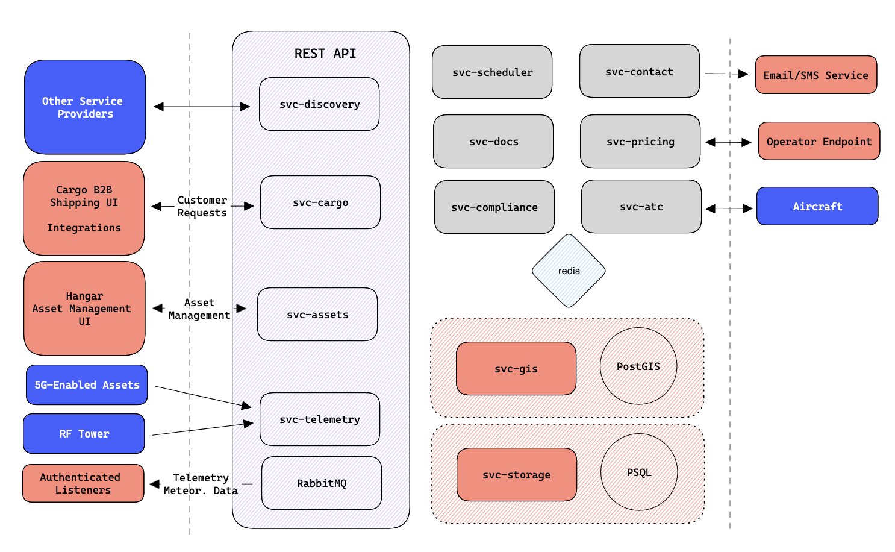

# Concept of Operations - Software Services

Item | Value
--- | ---
Maintainer(s) | @arrow-air/services
Author(s) | A.M. Smith
Status | Draft

:exclamation: This document is intended for internal use.

## 1.0 Motivation

*Photo Credit: [Lilium](https://lilium.com/newsroom-detail/lilium-partners-with-evolare)*

Electric vertical-takeoff-and-landing (eVTOL) networks offer an attractive transport solution: dynamic, rapid, point-to-point transit that flies above and beyond the competition. Boasting significantly less construction and maintenance costs and far less environmental disruption than roadways and rail, VTOL networks promise to outperform all other modes of travel in terms of affordability, accessibility, comfort, and speed. Urban aerial mobility (UAM) markets are set to expand dramatically within the next few years, with unmanned cargo operations already in full swing and passenger flights expected as early as 2026.

*Vertipads can be accommodated virtually anywhere.*

*Photo Credit: [Erik Mclean](https://www.pexels.com/@introspectivedsgn/)*

Key to the rapid expansion of VTOL networks is the diminutive footprint of the vertipad. Unlike runways for fixed wing aircraft, small vertipads can be accommodated atop existing infrastructure: rooftops, parking lots, floating docks, even ship decks! It may become commonplace for adjacent buildings - especially apartment complexes, business parks, and high rises - to have vertipads for commuting.

*Every rooftop is a potential vertipad.*

*Photo Credit: [Sergio Souza](https://www.pexels.com/@serjosoza/)*

Densely distributed vertipads will open the skies to a vast and motley assortment of aircraft: public transit ferries, independent rideshares, corporate charters, cargo deliveries by the dozen, municipal fleets, medical drones, construction surveyors, vigilant security patrols, and hundreds more. These aircraft will integrate with conventional air traffic, operating in and out of controlled and uncontrolled airports.

While use cases stretch as far as the imagination, airspace and regulatory resources may be far more limited. **If numerous aerial actors wish to integrate safely with conventional air traffic, airspace management and scheduling will need to evolve.**

## 1.1 Project Overview

This document proposes an open-source software architecture to support dynamic airspace management, data exchange, and regulatory compliance between Urban Aerial Mobility (UAM) actors. The proposed system undertakes the responsibilities of **Provider of Services to UAM (PSU)** and **Provider of Supplemental Data and Services (SDSP)** as outlined by the [NASA UAM Airspace Research Roadmap](https://ntrs.nasa.gov/citations/20220008917)[[nasa]](#nasa). It also proposes use cases in the form of cargo and passenger rideshare services.

**Provider of Services (PSU)** elements enable UAM operators to access airspace legally, safely, and securely. 

> "A PSU is an entity that provides services to the UAM Operator to help them meet UAM operational requirements that enable safe, efficient, and secure use of the airspace.   Multiple PSUs employed by different operators will be part of a network and subject to interoperability requirements.  The PSU is the trusted source for some of the traditional [Air Navigation Service Provider (ANSP)] services, such as distribution of notifications, confirmation of flight intent, and confirmation of authorized access to airspace." - [UAM Airspace Research Roadmap](https://ntrs.nasa.gov/citations/20210019876)

**Supplemental Data and Services Provider (SDSP)** elements provide *supplemental* or non-critical services for UAM operations.

> "Supplemental Data and Services Provider (SDSP): UAM Operators and PSUs use Supplemental Data Service Providers (SDSPs) to access supporting data including, but not limited to, terrain, obstacle, aerodrome availability, and weather. SDSPs may be accessed via the PSU network or directly by UAM operators." - [UAM Airspace Research Roadmap](https://ntrs.nasa.gov/citations/20210019876)

**Rideshare and Cargo Services** elements are client-facing and not essential. Downtime of these services doesn't impact airspace management or passenger safety.

We utilize a robust **microservice approach** running on a multi-cloud platform allowing us to use edge servers
for faster response times. To ensure high availability, we use autoscaling clusters that adjust resources
based on demand.

Descriptions of the individual services are covered in section 3.2.

The proposed open-source ecosystem attempts to capture the future of advanced aerial mobility as it could be. It aims to offer operators secure access to airspace, comply with the data exchange systems of multiple regulatory bodies, and allow interoperability with other service providers. In a supplemental capacity, it offers certification monitoring, telemetry broadcasts, logging, and secure storage.

### 1.1.1 Assumptions and Constraints

This architecture acknowledges the existence of other Providers of Service (PSUs), that vertiports and aircraft will be owned and operated by various companies and individuals, and that compliance with civil aviation authority differs from region to region.

This architecture intends to abide by standardized frameworks established by leading aviation regulatory bodies such as the FAA, NASA, and EASA (e.g. U-space) to ensure interoperability between UAM actors and systems.

## 2.0 Documents
### 2.0.1 Applicable Resources

| Resource | Type |
| --- | --- |
| [UAM Airspace Research Roadmap](https://ntrs.nasa.gov/citations/20210019876) | Website
| [NASA Air Traffic Management (ATM-X)](https://www.nasa.gov/aeroresearch/programs/aosp/atm-x/atm-x-project-description) | Website
| [NASA Extensible Traffic Management (xTM) Research ](https://ntrs.nasa.gov/citations/20210025112) | Website
| [FAA UAM Concept of Operations v2.0](https://www.faa.gov/sites/faa.gov/files/Urban%20Air%20Mobility%20%28UAM%29%20Concept%20of%20Operations%202.0_0.pdf) | PDF

## 3.0 Description of Envisioned System

## 3.1 Needs, Goals and Objectives of Envisioned System
Each service in this architecture is associated with a set of requirements.

Each service has its own set of documents which should be referred to for more detailed information. These documents include:
- Concept of Operations (CONOPS)
- Software Design Document (SDD)
- Interface Control Document (ICD)
- Verification and Validation (V&V) Document

Requirements for all microservices are hosted on our [Arrow Air NocoDB](https://nocodb.arrowair.com/dashboard/#/base/c436b0fb-9d80-4465-880c-860ce8300839) instance.

## 3.2 Overview of System and Key Elements

### 3.2.1 Provider of Services (PSU) Elements

These services enable UAM operators to access airspace legally, safely, and securely.

Microservice | Responsibilities
--- | ---
[`svc-scheduler`](https://github.com/Arrow-air/svc-scheduler) | Dynamic airspace management. Vertiport scheduling. Flight plan bookkeeping Fleet routing optimization.
[`svc-gis`](https://github.com/Arrow-air/svc-gis) | Abstracted interface to the PostGIS server.
[`svc-storage`](https://github.com/Arrow-air/svc-storage) | Abstracted storage interface for other services. Logs, flight plans, telemetry, vertiport specifications, personnel data, maintenance records, certification records, and so on. Gateway to the CockroachDB cluster.
[`svc-compliance`](https://github.com/Arrow-air/svc-compliance) | Notifications, flight restrictions, authorization approvals from local authority. Automated dispatch of flight plans and release requests to local authority. Regulatory formats such as FIDXP*.
[`svc-atc`](https://github.com/Arrow-air/svc-atc) | Responsible for de-conflicting active flight trajectories. Importance increases with number of aerial actors. Issues commands to aircraft to change airspace corridors to avoid possible collisions.
[`svc-discovery`](https://github.com/Arrow-air/svc-discovery) | Interaction with other PSUs. Standardized PSU interfaces such as U-Space.
[`svc-telemetry`](https://github.com/Arrow-air/svc-telemetry) | Receives, deduplicates, and stores live vehicle telemetry. Rebroadcasts to ATC tools and other authenticated listeners.

* FAA-Industry Data Exchange Protocol

Supplementary Processes | Responsibilities
--- | ---
[CockroachDB](https://www.cockroachlabs.com/product/) | A distributed PostgreSQL database designed for speed and scale.
[PostGIS](https://postgis.net/) | A spatial database extender for PostgresSQL.
[RabbitMQ](https://www.rabbitmq.com/) | Open source message broker for pub-sub relationships.
[Redis](https://redis.io/) | In-memory NoSQL database for fast caching and retrieval of key-value pairs.

### 3.2.2 Supplemental Data and Service Provider (SDSP) Elements

These elements provide *supplemental* (non-essential) services for UAM operations.

Some of these microservices expose a public API. They handle transactions with cargo and rideshare customers and are not essential to the operation of the PSU.

Service | Responsibilities
--- | ---
[`svc-assets`](https://github.com/Arrow-air/svc-assets) | Allow external clients to register and management assets (aircraft and vertiports).
[`svc-cargo`](https://github.com/Arrow-air/svc-cargo) | The public API for clients to request cargo transport through Arrow Services
[`svc-pricing`](https://github.com/Arrow-air/svc-pricing) | Provides the ticket price of an itinerary based on various pricing models.
[`svc-contact`](https://github.com/Arrow-air/svc-contact) | This service has sole access to customer information, the interface to issue notifications to a client
[`svc-docs`](https://github.com/Arrow-air/svc-docs) | Generates invoices and bills of lading for the customer and shipper.
`svc-payment` | Payment processing, accepting traditional payments and cryptocurrencies.
`svc-upkeep` | Monitor expiration of vehicle and component certifications Preemptively schedule flights for maintenance

## 3.3 External Interfaces
This section describes the interfaces of the system with any other systems that are external to the project. Interfaces *between* services are not shown in these diagrams.

 

Interface | Description
--- | ---
[`svc-discovery`](https://github.com/Arrow-air/svc-discovery) | Other PSUs may need to coordinate with this PSU in scheduling flights. Other PSUs may request information from the network.
[`svc-compliance`](https://github.com/Arrow-air/svc-compliance) | Information exchanged with civil aviation authorities may include notifications, confirmation of flight authorization, flight restrictions, flight corridors, and Special Use/Activity Airspaces (SAA). FAA-Industry Data Exchange Protocol (FIDXP) is an interface that allows UAM operators to obtain information from the United States [National Airspace System (NAS) Data Exchange](https://www.faa.gov/air_traffic/nas/). Data exchange formats may differ based on region.
[`svc-atc`](https://github.com/Arrow-air/svc-atc) | Issues commands to (especially unmanned) aircraft to change flight corridors, heading, velocity, or other flight characteristics in order to de-conflict colliding flight paths. Vehicle-to-vehicle avoidance should be last resort, as ATC should prevent these collisions in advance. Aircraft responses are captured by the telemetry service.
[`svc-telemetry`](https://github.com/Arrow-air/svc-telemetry) | Vertiports and vehicles broadcast telemetry, which is processed and stored by this service. This service may re-broadcast telemetry to clients such as Air Traffic Control (ATC) software. De-duplicates telemetry (from multiple reporters) for a clean feed to svc-atc.
[`svc-assets`](https://github.com/Arrow-air/svc-assets) | Operators can register and manage assets on the network.   This may include pricing configurations, usage restrictions, or availability.
[`svc-cargo`](https://github.com/Arrow-air/svc-cargo) | APIs for clients to request flights.
[`svc-contact`](https://github.com/Arrow-air/svc-contact) | Calls the API of an Email/SMS service with form data to contact customers, operators, and other stakeholders.
[`svc-pricing`](https://github.com/Arrow-air/svc-pricing) | Operators' pricing algorithms may exist on an outside server. They can expose an standardized API through which svc-pricing obtains the price of a flight for a customer using the operators' assets.
[RabbitMQ](https://www.rabbitmq.com/) | A message broker node streaming network data to authenticated listeners. Example: telemetry streams for air traffic control.

## 3.4 Capabilities

### 3.4.1 Aircraft Routing

Aircraft routing and automated ATC is performed with the help of a PostGIS database.

In this demonstration, **route nodes** are populated from a list of vertiports and aviation waypoints. These nodes are then used to build **routes**. We currently connect all nodes within 300 kilometers of one another. In the future, routes may be predetermined by the FAA, EASA, or other civil aviation agency.

Reports from `svc-compliance` are used to build **no-fly geometries** (either permanent or temporary). Routes that overlap with no-fly geometries at a customer's proposed flight time are discarded.

A shortest path algorithm (A*) then connects the departure vertiport to the arrival vertiport.

The list of waypoints is used to estimate a travel distance, duration, and (in coming releases) battery discharge.

These routes are planned to be expanded to include multiple vertically stacked flight corridors, each with a pair of separated lanes for travel in opposing directions. Such corridors are mentioned by the [FAA UAM CONOPS v2.0](https://www.faa.gov/sites/faa.gov/files/Urban%20Air%20Mobility%20%28UAM%29%20Concept%20of%20Operations%202.0_0.pdf) (figures 4, 5, 6, and 7).

Additionally, these corridors can be assigned a max capacity. Corridors at max capacity would be disregarded by the shortest path algorithm. This also allows for load balancing, prioritizing corridors with less utilization to spread traffic evenly.

### 3.4.2 Aircraft Selection

Once a route is established, the departure time is used to perform aircraft selection. This is handled by `svc-scheduler`.

As of software release three (R3), the following may occur:
- Aircraft that will already be on the departure pad at the departure time may be assigned to the itinerary.
- Nearby unassigned aircraft (on another pad or in air) may be assigned to the itinerary.
- Nearby aircraft still on-mission may be assigned the itinerary, to be completed after the conclusion of their current mission.

As demonstrated at the end of release two (R2), `svc-scheduler` will build a multi-hop itinerary for the aircraft that includes any deadhead (no cargo) flights needed to reach the departure pad.

### 3.4.3 Compliance

These details will be used to build a draft **flight plan**. If the customer confirms the plan within a deadline, it will be written to `svc-storage`.

`svc-compliance` will periodically check the status of flight plans in storage and will request approvals from the civil aviation authority for new entries.

### 3.4.4 Automated Air Traffic Control (ATC)

Initial `svc-atc` implementation is planned for R3 and also utilizes the PostGIS database.

This microservice seeks to de-conflict airspace by detecting overlaps in flight paths.

*Note: triangles appear warped due to spherical mercator projection. The actual area of each triangle is the same in this example.*

In future releases, `svc-atc` may command aircraft to change altitude, corridors, or other flight characteristics to reduce possibility of collision. `svc-atc` should maintain enough vehicle separation between aerial actors that onboard vehicle collision avoidance is a rare last resort.

### 3.4.5 Data Streams

RabbitMQ is an open-source message broker. At the moment, it is being used to rebroadcast de-duplicated telemetry to TCP listeners.

This setup can also be used to provide updates regarding meteorological reports, no-fly zones, temporary flight restrictions, and so on.

### 3.4.6 Client API

Scenario | Description
---- | ----
Cargo | Clients may request flights through a software API, website, or mobile app. Customer interaction is handled by `svc-cargo`, with confirmed flight requests forwarded the PSU domain of the Services ecosystem. Cargo clients provide a departure time, a departure vertiport, a destination vertiport, and the approximate weight of the cargo to be shipped.
Rideshare | Clients request flights through a software API, website, or mobile app. `svc-rideshare` handles the customer interaction, and forwards the request to the PSU domain. In this case, a client only provides a departure time, a departure vertiport, and a destination vertiport.

* Clients include individuals, companies, and automated processes

In all of the above scenarios, the `svc-scheduler` in the Arrow PSU receives a request for a new flight and determines if that flight can be accommodated. It must take into account numerous factors such as vertiport schedules, available aircraft, weather, and emergency conditions.

In the rideshare scenario, aircraft have a known flight schedule and number of seats. `svc-scheduler` will assign riders to an aircraft with available seats, with minor adjustments to departure times if necessary and possible. Similarly in the cargo scenario, the `svc-scheduler` will assign cargo to an available cargo aircraft.

In some cases, a flight plan request can be accommodated by simply swapping aircraft or lightly postponing a flight's departure time. `svc-scheduler`'s fleet routing optimization will perform these changes where allowed.

In cases where the journey cannot be accommodated, alternatives should be recommended. UAM operators (pilots, vertiport operators) may issue commands directly to the `svc-scheduler` to cancel or modify a plan. This may occur mid-flight, such as in a medical emergency, or on a vertiport pad, such as when a vehicle fails pre-flight checks. These events will trigger a fleet optimization from `svc-scheduler` to accommodate the shift in plans.
## 3.5 Modes of Operations

Modes of operation correspond with a general fleet routing behavior. They indicate the current goal of flight operations.

Mode | Description
--- | ---
Nominal | New flight plans may be created if they can be accommodated. Optimize rideshare flights to maximize passengers per aircraft. Optimize flight graph to accommodate more flights per hour. A buzzing flight graph maximizing motion.
Wind Down | No new flights plans are accepted (save for municipal and emergency flights) for a given time frame. Confirmed flight plans execute as previously planned. Can still add new rideshare passengers to existing flight plans. May occur daily to close flight operations if services are not 24/7. "Throttles" a flight graph to reduce the level of activity.
Emergency No-Fly | All aerial operations must cease at earliest opportunity, even if arrival vertiport is different than planned. Improvised landing zones are authorized at this stage to handle vertiport overflow. All live aircraft in the flight graph immediately "seek cover" at the nearest safe haven.

Fleet routing can also be impacted by other factors such as vertiport redirect orders, restricted (or "special use") airspaces, and emergency flights taking precedence. These factors may apply to multiple modes of operation. In some cases, such as an emergency no-fly scenario, they are intentionally ignored.

## 4.0 Operational Scenarios, Use Cases and/or Design Reference Missions

See "Modes of Operation" (section 3.5).

Mode | Scenario
--- | ---
Nominal | Nominal flight operations
Wind Down | Ending daily flight operations Overtaxed flight graph - intense delays, many hovering aircraft waiting for landing clearance
Emergency No-Fly | Terrorism (including cyber attacks) Sudden weather changes, such as a tornado touchdown

The current mode can be conveyed over radio or cellular channels in the event of a critical outage of software services (electrical failures, solar flares, etc.). Such an event should initiate "Wind Down" mode (at minimum), and each pilot and UAM operator will follow a manual procedure for vertiport access and selection of improvised landing sites, if necessary.

## 4.1 Nominal & Off-Nominal Conditions

Nominal and off-nominal conditions will be addressed by service-level requirements, which will link up to high-level requirements. These documents are still being developed.

Existing documents in this realm include:
- [Services User Stories](https://nocodb.arrowair.com/dashboard/#/nc/view/ce300383-bc2c-4023-afb7-83ebe062de56)
- [Visualized Rideshare Scenarios (Slides)](https://docs.google.com/presentation/d/1Nt91KVIczhxngurfyeIJtG8J0m_38jGU1Cnqm1_BfPc/edit#slide=id.p1)

## 5.0 Physical Environment

The physical environment of these services is a set of servers. The location of the servers depends on the services.

*An example server room.*

*Disclaimer: not our servers.*

*Photo Credit: [Manuel Geissinger](https://www.pexels.com/@artunchained/)*

### 5.0.1 PSU Locations
Provider of Service (PSU) elements will be replicated per region, meaning each region with Arrow operations should host a local physical server. This is to minimize communication delay to aerial actors within the region of operation and to reduce the load on each service by filtering out other regions. 

For example, a city will have its own `svc-scheduler` instance that only manages the airspace and vertiport schedules of that city's region. Cross-region transfers will be negotiated through the city's PSU interface (`svc-discovery`) and the destination region's PSU interface (which may be another `svc-discovery`, if the destination PSU is based on Arrow Services).

PSU services are *safety-critical* and must continue to execute as long as there are aerial operations occurring. Downtime of the `svc-scheduler` in particular can produce unfavorable conditions for pilots, who would no longer be notified of vertiport schedules.

### 5.0.2 SDSP Locations
Supplemental Data and Service Provider (SDSP) elements may also be deployed per region. 

As UAM actors may downlink terabytes of telemetry daily, `svc-telemetry` is a strong candidate for a per-region deployment, as is `svc-storage` for the same reason. Local UAM operators using Air Traffic Control and Ground Control System software may rely on rapid telemetry updates and storage read operations.

Temporary downtime of SDSP services is tolerable to an extent. Ultimately a human pilot is still responsible for flying and landing an aircraft safely.

### 5.0.3 Rideshare and Cargo Services Locations
These services are not mission-critical, nor do they require sub-second response times. One set of rideshare and cargo services may serve multiple regions, depending on user request load. This will be determined through beta testing and simulation.

### 5.0.4 Physical Server Considerations
Coordinating the movements of thousands of aerial actors over an urban environment is akin to knife juggling in a crowd, in that any interruption of the software services can result in catastrophic consequences. Preventative measures should be taken to ensure continued uptime in the event of physical (and cyber) dangers to server operations.

These possibly include:
- Energy-storing devices (such as mechanical flywheels) placed between the power grid and critical hardware components
  - In a blackout, powers servers and communication arrays temporarily with no interruption
- Redundant atmospheric control systems in the server bay
- Restricted access to server bay on par with FAA systems
- Subterranean server bays as some measure of protection against solar flares
- Reducing operations with extreme prejudice in response to unfavorable weather forecasts

## 6.0 Support Environment

Arrow (or a division of the local civil aviation authority) will maintain a team of IT professionals and system administrators. Some of these individuals may require government clearance or special regulatory licenses depending on the location and capabilities of the system.

Each instance of the PSU is composed of various microservices. These microservices may be upgraded or downgraded remotely for incremental rollout or rollback on a region-by-region basis. Arrow will maintain a live map of the status and versions of each service, information which is contained in each service's health and status packet. Configuration management (CM) will be detailed in a separate, more detailed document.

An authorized individual should be onsite (or nearby) at every server location during aerial operations to attend server hardware in the event of crashes and outages.

## 7.0 Impact Considerations

This section limits discussion to Arrow software services which enable rideshares, cargo operations, and numerous simultaneous aerial actors.

*Photo Credit: [Lilium Press Release](https://lilium.com/newsroom-detail/helity-lilium-develop-network-andalusia)*

### 7.0.1 Benefits

While a future without roads is surpassingly distant, VTOL routes present a strong case for new connections, especially where geographical isolation is a factor.

VTOL aircraft operations require substantially less physical infrastructure and maintenance than rail or automobile travel. Flying at an altitude above the treeline, VTOL aircraft operations leave the landscape untouched between the points of travel. Vertipads boast a relatively minimal footprint, and are easier and faster to build and maintain than miles of road. On this count, point-to-point aerial travel would connect rural communities far more cheaply, sustainably, and quickly than ground transit.

Consider the following environments for which eVTOL technologies thrive:

*Steep Terrain*

*VTOL aircraft take a more direct route.*

*Photo Credit: [Mogildea Justin](https://www.pexels.com/@mogildea-justin-1851928/)*

*Urban Rapid Transit*

*VTOL aircraft can traverse the breadth of this dense metropolitan center in mere minutes, unburdened by street grids or traffic.*

*Photo Credit: [Jimmy Chan](https://www.pexels.com/@jimbear/)*

        

*Hills, Forests, Wetlands, and Rivers*

*VTOL aircraft soar overhead without touching the environment. Zero bridges, tunnels, and roads to lay or maintain.*

*Photo Credit: [Erik Mclean](https://www.pexels.com/@introspectivedsgn/)*

*Islands*

*[Vanuatu](https://wingcopter.com/project/story-vanuatu) and [The Aran Islands](https://wingcopter.com/project/story-ireland) are embracing VTOL technologies for rapid aerial deliveries without runway or bridge construction.*

*Photo Credit: [Asad Photo Maldives](https://www.pexels.com/@asadphotography/)*

*Ship-to-Ship, Ship-To-Land*

*Flights between mobile platforms, from shipboard to far inland.*

*Photo Credit: [Alexander Bobrov](https://www.pexels.com/@alexander-bobrov-390088/)*

This deserves some special note; where traditionally vessels must dock and unload at a specific location, aerial unloading can be performed from a vessel anywhere offshore to any location inland (within the limits of the cargo vehicle).

*Undeveloped Regions*

*VTOL technologies like [Zipline](https://www.flyzipline.com/) are currently connecting towns and villages that don't have developed automobile infrastructure.*

*Photo Credit: [Anna Shvets](https://www.pexels.com/@shvetsa/)*

### 7.0.2 Drawbacks

Early tests indicate that [VTOL aircraft have a lower takeoff decibel rating than a helicopter](https://ntrs.nasa.gov/citations/20220006729)[[decibel]](#decibel). Even so, the combination of hundreds of drones and aircraft could make a noticeable contribution to urban noise.

The effects of increased VTOL aerial operations on wildlife should be researched. Migratory patterns of avian and inspect species could be impacted by aerial traffic. Further research is needed in this area.

## 7.2 Organizational Impacts

This section discusses potential jobs and positions in an Arrow network. It is largely speculative.

*Photo Credit: [Lilium Press Release](https://lilium.com/newsroom-detail/lilium-q3-business-update)*

### 7.2.1 Vertiport Operators

Vertiports on the Arrow network stand to be owned and operated by:
- Government
- Private Corporations
- Individuals

In all three cases, Arrow may impose operational and cleanliness standards for a vertiport to be supported by the Arrow network. These standards would be informed in part by government requirements.

A vertiport operator's responsibilities include ensuring that:
- Aircraft depart on schedule.
- Operational status is accurately reported.
- Standards of safety and cleanliness are met for the entire vertiport (pads and adjoining passenger areas).

Only specific persons in the Arrow database can conduct pre-flight inspections and approve aircraft takeoff. Vertiport operators are responsible for maintaining and accurately reporting the certifications of personnel.

Periodic inspections may occur, conducted through an independent agency or a rotating team of Arrow officials. The details of the inspection would be stored in an immutable (uneditable) database and would include the name of the inspector and agency for public review.

### 7.2.2 UAM Controllers (aka Fleet Operators)

Above vertiport operators in the chain of command is the UAM controller.

A UAM controller is responsible for a UAM region. A controller must maintain their certification. The UAM controller may work directly for the civil aviation authority (such as the FAA). In an emergency scenario, a UAM controller can dictate mandatory orders to various vertiport operators.

The UAM controller utilizes air traffic control (ATC) software to monitor aerial operations. They may directly contact pilots over voice channels unconnected to the ATC software.

Fleet operators may employ dispatchers who work in a similar capacity.

### 7.2.3 Aviation Mechanics

Aviation mechanic certification is offered by some civil aviation authorities, such as ["FAA-certificated Aviation Maintenance Technicians (AMT)"](https://www.faa.gov/mechanics/become).

The employment structure of aviation mechanics is to be determined. Outside of government regulations, VTOL manufacturers may insist on hiring their own licensed and bonded mechanics. Each manufacturer may also establish their own maintenance vertiports, or claim a dedicated portion of a large vertiport.

Alternatively, maintenance vertiports may be completely shared. A certified mechanic may be able to work on any make or model of aircraft.

Certified mechanics may set up their own vertiports on the Arrow PSU, similar to automobile repair shops. A dedicated vertiport operator is still required in this case. Collective ownership of a vertiport by multiple attached mechanic shops is allowed and encouraged.

### 7.2.4 System Administrators and IT Services
Servers and onsite tech support.

### 7.2.5 Government Liaisons

Consultants or part-time government liaisons will be required to communicate with civil aviation authorities, especially in countries where English is not the primary business language.

### 7.2.6 Legal

Handle lawsuits against the Arrow Services. Crisis management, prevention. Adherence to local civil aviation laws. Submission of appropriate paperwork.

### 7.2.7 Public Relations

Design, advertising, community outreach, rider surveys.

## 7.3 Technical Impacts

### 7.3.1 Economy

eVTOL aircraft herald a wave of new jobs and economic opportunities. Among which are big ticket items like research, manufacturing, software development, materials testing, certification, maintenance, repair, and functional vertiport design.

Economic opportunity may ripple outwards from vertiports. They may be epicenters of new development, including housing, business, recreation, and dining. Private vertiports may be an apartment complex amenity or an employment perk. A vertiport may be collectively owned and maintained by surrounding repair shops or mall tenants.

Urban drone delivery operations, which will cooperate with VTOL aircraft on the same network, will enable new logistics and last-mile transport businesses.

### 7.3.2 Municipal Budget

The cost to establish a new transit route with VTOLs is significantly lower than traditional transit. Already touched on in "Environmental Impacts" is the low cost of building and maintaining new VTOL network routes - specifically, the cost of a vertiport.

New VTOL routes are established the moment that a vertipad is built and staffed. No tramways, rails, roads, tunnels, bridges, or highways need to be built, making VTOL a cost-effective solution for areas isolated by geography or lack of public transit.

### 7.3.3 Alternative To Automobile Journeys

*Light rail can be an affordable transit solution within a city.*

*Photo Credit: [Andrea Piacquadio](https://www.pexels.com/@olly/)*

Each mode of transit serves a distinct need.
- Railways offer long distance rapid freight and passenger transport between select stations in populous zones.
- Light rail offers mass transit between neighborhoods.
- Bus routes collect passengers in areas unserved by light rail tracks.

However, each mode also presents inconveniences to the customer.
- Railway and light rail travel is limited to the location of stops and stations, which can be spaced far apart.
- Bus routes, theoretically more flexible to new destinations than rail, presents similarly to light rail to the passenger: a vehicle locked on an inflexible route, stopping at fixed locations.
- Vehicle switching, taking multiple routes to reach the final destination.

*Photo Credit: [Ruiyang Zhang](https://www.pexels.com/@ruiyang-zhang-915467/)*

Private automobiles offer flexible on-demand travel on any street to any destination. However, this flexibility comes with a significant cost. A reliable automobile is an expensive purchase for many, and is made more expensive by maintenance, insurance, petrol, and registration fees that accumulate throughout the year. The ubiquity of automobile use results in significant highway and road infrastructure taxes, increased carbon emissions, and ever-creeping parking needs.

In automobile-centric nations with underdeveloped public transit, automobile ownership is necessary for many individuals to hold a job. Consider this [statement by the San Diego Workforce Partnership](https://workforce.org/news/transportation-equity-is-about-workforce-equity-too/):
> Because of the considerable milage and layout of [San Diego County], only 1% of jobs are accessible within 30 minutes by transit and just 8% are accessible in 60 minutes. That means that the 78% of MTS riders who do not have an available car also do not have access to more than 90% of jobs in San Diego. This divide has created economic inequality for many neighborhoods and hampers the ability for low-income communities to create generational wealth.

It is generally true that *individuals will choose the most convenient mode of transportation available to them*. If public transit does not offer plentiful availability (insufficient routes, buses, and stops) or routes take too long, individuals will turn to private automobiles or rideshares.

Now consider a rideshare network of VTOL aircraft as an alternative to an automobile journey in terms of rider convenience:
- **Faster**: VTOL flights stand to be considerably faster than car, bus, or light rail options, which are subject to traffic and street grid stoppages.
    - This alone may be sufficient to convert drivers to riders, especially in traffic-congested regions like Los Angeles or Hong Kong.
    - Quicker VTOL journeys may be cheaper than car rideshare.
- **Direct**: Vertipads are cheaply and rapidly constructed on top of existing infrastructure for direct routes to office buildings, apartment complexes, and other commuting locations.
    - Imagine exiting your apartment and taking the elevator to the roof instead of the parking lot.
    - This includes longer routes that light rail and bus lines may not normally serve, such as those to rural or suburban areas.
    - No need to switch vehicles, which is a common inconvenience for bus and light rail routes.
- **On Demand**: Similar to automobile rideshare, VTOL rideshare can similarly be requested at any time.
    - Infrequent (30 to 60 minute) spacing in bus route timetables is a frequent turnoff for prospective riders.
- **No Parking**: A major source of ire for private automobile ownership is finding and paying for parking.
    - Car rideshares are often used to avoid parking.
    - Replaces the "drive-park-walk-drive" model with the "walk-fly-walk" model of intracity travel.

### 7.3.4 Stronger Connections with Rural Regions

An on-demand aerial transport solution, to which geographical barriers are largely a non-issue, has the potential to strengthen ties with rural regions by increasing access and cutting commute time for all passengers involved.

Consider the journey between the city of Huntington, West Virginia and the rural town of Julian, West Virginia.

*A winding road in hilly West Virginia.*

*The geographical distance between the two populations is 59 kilometers. The shortest distance by car is 80 kilometers.*

*Screenshot Credit: Google Maps*

This trip is projected to take 75 minutes by car. The [Lilium Jet, advertising a top speed of 300 kph (186 mph)](https://evtol.news/lilium/), can complete this journey in approximately **15 minutes**.

Likewise, consider this trip between Madagascar's capital city and its nearest port city.

*No other transit solutions are available.*

*Screenshot Credit: Google Maps*

The geographical distance between these two cities is 215 kilometers. The aforementioned Lilium jet could cover this distance in approximately 45 minutes - quite the improvement over the projected 8-hour car journey.

**Consider the economic opportunities this presents, both as a means of shipping and as a means of human transport.**
- A largely reduced commute time expands the radius of employment opportunities for workers in rural regions.
    - It may also convince individuals who work in the urban center to live further outside of it.
- An aerial route ignores innumerable adverse road conditions that can delay or endanger ground shipments between urban and rural areas.

### 7.3.5 Expansion of Academic Fields

A new method of transportation has the power to redefine the human experience. It will open new chapters of sociology, ecology, economics, architecture, and urban planning. VTOL networks will affect our rooftops, our wallets, local wildlife, climate, and our connectivity to others.

## 8.0 Risks and Potential Issues

### 8.0.1 Struggles of Non-Automobile Transit

*Photo Credit: [Aleks Magnusson](https://www.pexels.com/@aleksmagnusson/)*

It can generally be stated that individuals will choose the most convenient form of transportation available to them. In many U.S. cities, this would be an automobile.

Consider the top reasons why respondents avoided public transit in a [2019 Opinion Survey of Transit in San Diego, California, U.S.A.](https://drive.google.com/file/d/1vR8G-ymRao2brI_fn5e8n9XUVz9SFjxJ/view?usp=share_link)[[sandag]](#sandag):
> - System not complete enough/not in my area/can't reach destination
> - Public transit is too slow
> - Have other errands I need to do that require a car
> - Can't get to/from stops or stations by walking
> - Services run too infrequently
> - Not comfortable with other riders/people at stations
> - Public transit travel time is too unreliable
> - Services don't run early/late enough

These opinions touch on the main limitations of a public transit system:
1) Vehicles stop at a limited set of locations
2) Vehicles are limited to specific routes (light rail and buses)
3) Throughput is limited by the number and capacity of vehicles in circulation
4) Safety concerns from other riders who aren't behaving civilly

Limited locations may demand significant walking for prospective riders. At worst, distances are so great that individuals will choose private automobile transport instead (especially in adversely hot, cold, or stormy weather). This [2019 study in Munich, Germany](https://www.emerald.com/insight/content/doi/10.1108/SASBE-07-2017-0031/full/html#sec004)[[munich]](#munich) found that interest in public transit drops significantly when walking time exceeds 15 minutes.

Limited routes are also a serious problem afflicting ridership. It is not uncommon for passengers to take multiple buses or trains to reach their destination), with each leg increasing inconvenience and cost - if their destination is reachable at all. It is also not uncommon for riders to hail a rideshare or use a private automobile between a station and a location.

Regarding infrequent service, [prospective public bus transit ridership steeply drops after 10 minutes](https://www.scirp.org/journal/paperinformation.aspx?paperid=95820#t1) [[survey]](#survey). With both this study and the Munich study, drop-off in interest is not linear. There is a nearly binary threshold at which public interest abruptly shifts.

To an extent, VTOL networks are also affected by these factors. VTOL aircraft are limited to specific landing zones ("vertiports") which may be even more sparsely distributed than transit stops. They also don't carry as many passengers as a train, trolley, or bus. An insufficient quantity of vehicles, vertiports, and pickup times render VTOL benefits inconsequential if rider demand can't be met.

### 8.0.2 Socioeconomic Disparity in Early Ridership

Especially in early phases with limited vertiport and aircraft, rideshares and charters will possibly charge a premium in order to fund further capital investment in the VTOL network. These premiums are planned to dissipate with increased access and vertiport competition. However, it would be honest to postulate that a socioeconomic disparity in ridership could be present in early operations.

It is not Arrow's intention to solely market to high-income persons. In the long term, it is critical that all individuals spanning the income spectrum continue to choose VTOL services over automobiles. Politically, the support of affluent individuals and the popular vote of middle-to-lower income riders will be critical to establishing more vertiports and increasing rider throughput. Ethically and morally, it is incumbent that new and better transit solutions are offered equally to individuals of all socioeconomic statuses. Given that VTOL networks are an economic gateway, failure to do so would be a direct contribution to wealth inequality.

### 8.0.3 Political Opposition

*Photo Credit: [Michael Tuszynski](https://www.pexels.com/@michael-tuszynski-1134777/)*

Potential opponents to VTOL services could include:
- Petrol & Gas, Automotive:
  - Electric UAM operations may reduce reliance on the automobile
- Real Estate, Homeowners:
  - [NIMBY-ism](https://en.wikipedia.org/wiki/NIMBY)
  - VTOL sound pollution
  - Privacy
- Taxi Driver Unions
  - Similar opposition to rideshare
- Environmental Lobbies
  - Impact on wildlife

### 8.0.4 Anonymous Contribution

Arrow is an open-source ecosystem with many anonymous international contributors. It is understood that some government systems place restrictions on non-citizen developers or require identity verification. Arrow will be seeking guidance from regulatory bodies on this matter.

As it stands, Arrow has a strict set of rules in place to ensure trustworthy contributions to the codebase.

Arrow requires multiple "code owner" approvals before code can be contributed. Code owners are administrators of the Arrow software teams and have substantial personal involvement with the Arrow codebase. The codebase does not allow contributions without proper approvals, even changes from administrators themselves.

Arrow requires contributors to "sign" changes using a cryptographic signature (GPG). The signature indicates that a single individual's account is responsible for all changes made in their name. The Arrow code repositories will automatically reject unsigned changes.

Online ID verification services can be used to verify identities while preserving contributors' anonymity. These are not used by Arrow as of yet.

In addition to official security audits, Arrow will periodically offer public bounties for documented exploits. The white hat hacker community's help will be invaluable in securing our services and demonstrating our commitment to cyber security.

### 8.0.5 International Contributors

We will be seeking guidance from NASA, FAA, EASA, and other regional agencies regarding restrictions on non-citizens contributors.

## Appendix A: Citations

<a id="nasa">[nasa]</a> Levitt, I., Phojanamongkolkij, N., Horn, A., Witzberger, K., “UAM Airspace Research Roadmap Rev. 1.2 - NASA Technical Reports Server (NTRS).” NASA, NASA, https://ntrs.nasa.gov/citations/20220008917

<a id="decibel">[decibel]</a> Pascioni, Kyle A, et al. “Acoustic Flight Test of the Joby Aviation Advanced Air Mobility Prototype Vehicle - NASA Technical Reports Server (NTRS).” NASA, NASA, https://ntrs.nasa.gov/citations/20220006729. 

<a id="munich">[munich]</a> Sarker, R.I., Mailer, M. and Sikder, S.K. (2020), "Walking to a public transport station: Empirical evidence on willingness and acceptance in Munich, Germany", Smart and Sustainable Built Environment, Vol. 9 No. 1, pp. 38-53. https://doi.org/10.1108/SASBE-07-2017-0031

<a id="sandag">[sandag]</a> Redhill Group (2020), 2019 SANDAG Transit Public Opinion Survey - Final Report, pp. 32-37, https://drive.google.com/file/d/1vR8G-ymRao2brI_fn5e8n9XUVz9SFjxJ/view?usp=share_link

<a id="survey">[survey]</a> Arhin, S., Ptoe, P., Gatiba, A., Anderson, M. , Ribbisso, M. and Manandhar, B. (2019) Patron Survey of Acceptable Wait Times at Transit Bus Stops in the District of Columbia. Open Journal of Civil Engineering, 9, 268-280. doi: 10.4236/ojce.2019.94019

## Appendix B: Acronyms & Glossary

See the [Arrow Glossary](https://nocodb.arrowair.com/dashboard/#/nc/view/7235b38d-12e4-4e4e-8210-bc564be1706e).
