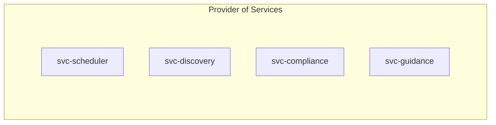
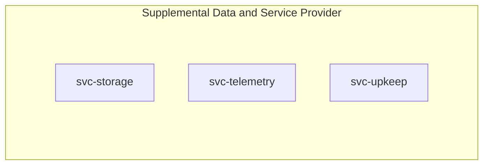
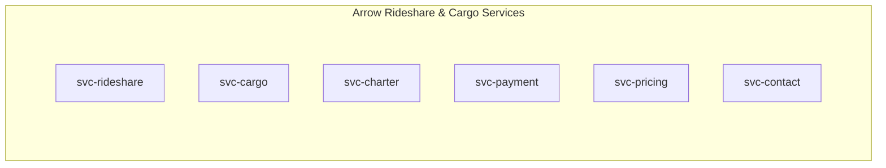
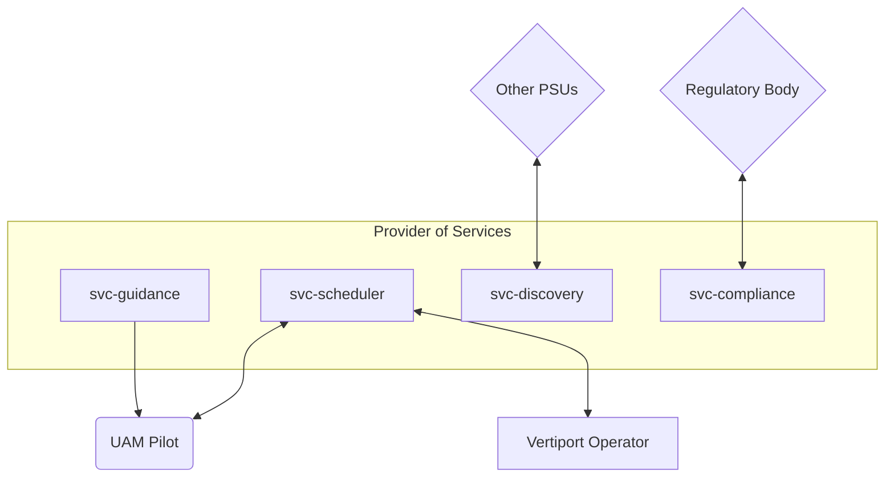
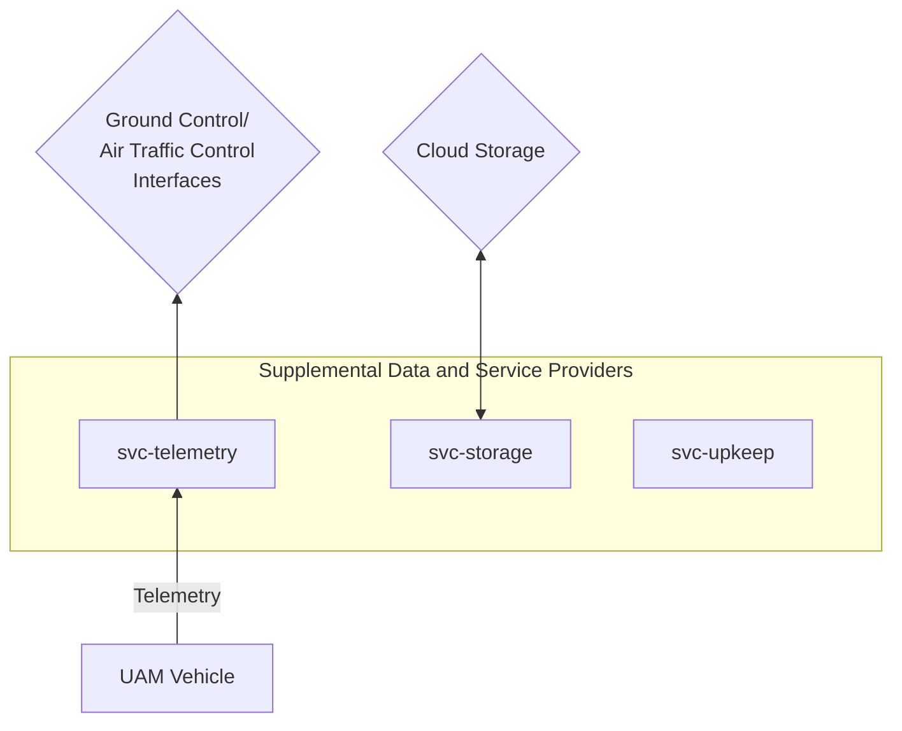
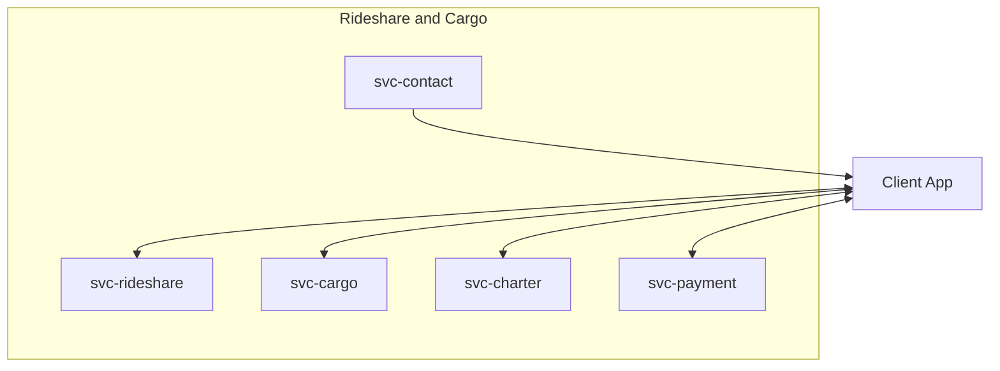

# Concept of Operations - Software Services

Item | Value
--- | ---
Maintainer(s) | @arrow-air/services

:exclamation: This document is intended for internal use.

## 1.0 Project Description

### 1.0.1 Motivation

The electric vertical takeoff and landing (eVTOL) aircraft is poised to revolutionize transport. In an urban environment plagued by congested roadways, costly infrastructure, and socioeconomic inequality, eVTOL networks offer an attractive solution: rapid, on-demand, point-to-point transit that flies above and beyond the competition. Boasting significantly less construction and maintenance costs than roadways - and far less environmental disruption - VTOL networks promise to outperform all other modes of travel in terms of affordability, accessibility, comfort, and speed. Urban aerial mobility (UAM) markets are set to expand dramatically within the next few years, with initial flights expected as early as 2026.

The impressively compact, helipad-like footprint of a vertiport allows dense distribution throughout the urban and suburban landscape. Accessible vertiports will open the skies to a vast and motley assortment of aircraft: public transit ferries, independent rideshares, corporate charters, cargo deliveries by the dozen, municipal fleets, medical drones, construction surveyors, vigilant security patrols, and hundreds more. While use cases stretch as far as the imagination, airspace and vertiport resources may be far more limited. If these myriad aerial actors wish to share ports and skies safely, traditional airspace management will need to evolve.

This document proposes an open software architecture to support dynamic airspace management, data exchange, and regulatory compliance between Urban Aerial Mobility (UAM) actors. The proposed system undertakes the responsibilities of **Provider of Services to UAM (PSU)** and **Provider of Supplemental Data and Services (SDSP)** as outlined by the [NASA UAM Airspace Research Roadmap](https://ntrs.nasa.gov/citations/20210019876). It also proposes use cases in the form of rideshare and cargo services.

The proposed open source ecosystem attempts to capture the future of advanced aerial mobility, as it could be. It enables operators safe and secure access to airspace, manages emergency contingencies, complies with the data exchange systems of multiple regulatory bodies, and allows interoperability with other service providers. In a supplemental capacity, it offers automated maintenance scheduling, certification monitoring, telemetry rebroadcasts, and secure storage. Underscoring all systems is the concept of interoperability: that aircraft from numerous manufacturers, countries, and service providers may cooperate on the same network.

### 1.0.2 Assumptions and Constraints
This architecture acknowledges the existence of other Providers of Service (PSUs), that vertiports and aircraft will be owned and operated by various companies and individuals, and that compliance with civil aviation authority differs from region to region.

This architecture intends to abide by standardized protocols established by NASA, EASA, and other agencies to ensure interoperability between UAM actors and systems.

## 1.1 Overview of the Envisioned System

### 1.1.1 Overview

The Arrow Software Services are broken into several domains of responsibility.

 

 

**Provider of Services (PSU)** elements enable UAM operators to access airspace legally, safely, and securely. 

> "A PSU is an entity that provides services to the UAM Operator to help them meet UAM operational requirements that enable safe, efficient, and secure use of the airspace.   Multiple PSUs employed by different operators will be part of a network and subject to interoperability requirements.  The PSU is the trusted source for some of the traditional [Air Navigation Service Provider (ANSP)] services, such as distribution of notifications, confirmation of flight intent, and confirmation of authorized access to airspace." - [UAM Airspace Research Roadmap](https://ntrs.nasa.gov/citations/20210019876)

**Supplemental Data and Services Provider (SDSP)** elements provide *supplemental* or non-critical services for UAM operations.

> "Supplemental Data and Services Provider (SDSP): UAM Operators and PSUs use Supplemental Data Service Providers (SDSPs) to access supporting data including, but not limited to, terrain, obstacle, aerodrome availability, and weather. SDSPs may be accessed via the PSU network or directly by UAM operators." - [UAM Airspace Research Roadmap](https://ntrs.nasa.gov/citations/20210019876)

**Rideshare and Cargo Services** elements are client-facing and not essential. Downtime of these services doesn't impact airspace management or passenger safety.

Descriptions of the individual services are covered in section 3.2.

## 2.0 Documents
### 2.0.1 Applicable Resources

| Resource | Type |
| --- | --- |
| [UAM Airspace Research Roadmap](https://ntrs.nasa.gov/citations/20210019876) | Website
| [NASA Air Traffic Management (ATM-X)](https://www.nasa.gov/aeroresearch/programs/aosp/atm-x/atm-x-project-description) | Website
| [NASA Extensible Traffic Management (xTM) Research ](https://ntrs.nasa.gov/citations/20210025112) | Website

## 3.0 Description of Envisioned System

## 3.1 Needs, Goals and Objectives of Envisioned System
Each service in this architecture is associated with a set of requirements.

Each service has its own set of documents which should be referred to for more detailed information. These documents include:
- Concept of Operations (CONOPS)
- Software Design Document (SDD)
- Interface Control Document (ICD)
- Verification and Validation (V&V) Document

A set of user stories for rideshare and cargo operations is currently tracked on the [Arrow Google Drive](https://docs.google.com/spreadsheets/d/1Ad238NAEj6QUzgsjPTRRFJy6NiQVQt2e7affwVVDAFo/edit?usp=sharing).

## 3.2 Overview of System and Key Elements

### 3.2.1 Provider of Services (PSU) Elements

These services enable UAM operators to access airspace legally, safely, and securely.

 

Service | Responsibilities
--- | ---
`svc-scheduler` | Dynamic airspace management Vertiport scheduling Flight plan bookkeeping Fleet routing optimization
`svc-discovery` | Interaction with other PSUs Adheres to standardized PSU interfaces
`svc-compliance` | Notifications, flight restrictions, authorization approvals from local authority Automated dispatch of flight plans and release requests to local authority Complies with regulatory file formats such as FIDXP*
`svc-guidance` | Noncompulsory flight path guidance Importance increases with number of aerial actors

* FAA-Industry Data Exchange Protocol

 

### 3.2.2 Supplemental Data and Service Provider (SDSP) Elements

These elements provide *supplemental* (not safety-critical) services for UAM operations.

 

Service | Responsibilities
--- | ---
`svc-storage` | Abstracted storage interface for the other services Logs, maintenance records, certification records, and so on
`svc-telemetry` | Receives and stores live vehicle telemetry* Rebroadcasts to ground control/air traffic control tools and other listeners
`svc-upkeep` | Monitor expiration of vehicle and component certifications Preemptively schedule flights for maintenance

* May qualify as a PSU element.
### 3.2.3 Rideshare and Cargo Services

These client-facing services expose an API. These are not safety-critical.

 

Service | Responsibilities
--- | ---
`svc-rideshare` | The public API for passengers to request rides through Arrow Services 
`svc-cargo` | The public API for clients to request cargo transport through Arrow Services
`svc-charter`| The public API for individuals filing charters for specific aircraft.
`svc-pricing` | Provides the ticket price of an itinerary based on various pricing models.
`svc-payment` | Payment processing, accepting traditional payments and cryptocurrencies.
`svc-contact` | This service has sole access to customer information, the interface to issue notifications to a client

 

## 3.3 External Interfaces
This section describes the interfaces of the system with any other systems that are external to the project. Interfaces *between* services are not shown in these diagrams.

### 3.3.1 PSU Interfaces

 

 

`svc-scheduler`:
- Reports schedules to Vertiport Operators and Pilots in Control (PIC).
- Vertiport Operators and Pilots may make requests to the scheduler to delay or accelerate a departure, cancel a flight, or initiate emergency operations.

`svc-compliance`:
- Information exchanged with civil aviation authorities may include notifications, confirmation of flight authorization, flight restrictions, charted routes, and Special Use/Activity Airspaces (SAA).
- FAA-Industry Data Exchange Protocol (FIDXP) is an interface that allows UAM operators to obtain information from the United States [National Airspace System (NAS) Data Exchange](https://www.faa.gov/air_traffic/nas/).
- Data exchange formats may differ based on region.

`svc-discovery`:
- Other PSUs may need to coordinate with this PSU in scheduling flights to vertiports.
- Example: proprietary PSU schedules a flight from a private vertiport to a public vertiport managed by this PSU.
- Example: regional instances of *svc-scheduler* coordinate to transfer stewardship of an aircraft departing one PSU's region into another PSU's region.

`svc-guidance`:
- Calculating flight paths will be increasingly important as the number of simultaneous airborne UAM vehicles increases.
- Flight paths are chosen at the discretion of the Pilot in Control (PIC). Suggested flight paths from this service should be taken into consideration when planning the general route.

### 3.3.2 SDSP Interfaces

 

 

`svc-telemetry`:
- UAM vehicles broadcast telemetry, which is processed and stored by this service.
- This service may re-broadcast telemetry to clients such as Air Traffic Control (ATC) software.

`svc-storage`:
- Links to multiple storage solutions, paired with specific types of data.
- Blockchain storage provides defensive "immutable" record keeping for certifications, maintenance records, previous flight plans, FAA confirmations.
- Databases for CRUD operations on flight plans
- Storage may be local to the services or on a cloud server.

### 3.3.3 Rideshare and Cargo Interfaces

 

 

`svc-rideshare`, `svc-cargo`, `svc-charter`:
- APIs for clients to request flights. Separated from airspace management (`svc-scheduler`).

`svc-payment`:
- API for client apps to make payments in exchange for services.

`svc-contact`:
- Access to customer SMS, Email, Push Notifications
## 3.4 Proposed Capabilities

 

Scenario | Description
---- | ----
Private Charter | Clients* can register a flight plan through `svc-charter`, which passes their request to the Arrow PSU. Clients submit a flight plan specifying an aircraft, the departure vertiport, the arrival vertiport, the flight manifest, and the planned departure date and time.
Rideshare | Clients request flights through a software API, website, or mobile app. `svc-rideshare` handles the customer interaction, and forwards the request to the PSU domain. In this case, a client only provides a departure time, a departure vertiport, and a destination vertiport.
Cargo | Clients may request flights through a software API, website, or mobile app. Customer interaction is handled by `svc-cargo`, with confirmed flight requests forwarded the PSU domain of the Services ecosystem. Cargo clients provide a departure time, a departure vertiport, a destination vertiport, and the approximate weight of the cargo to be shipped. They may also specify if the trip will be recurring for planned deliveries.

* Clients include individuals, companies, and automated processes

 

In all of the above scenarios, the `svc-scheduler` in the Arrow PSU receives a request for a new flight and determines if that flight can be accommodated. It must take into account numerous factors such as vertiport schedules, available aircraft, weather, and emergency conditions.

In the rideshare scenario, aircraft have a known flight schedule and number of seats. `svc-scheduler` will assign riders to an aircraft with available seats, with minor adjustments to departure times if necessary and possible. Similarly in the cargo scenario, the `svc-scheduler` will assign cargo to an available cargo aircraft.

In some cases, a flight plan request can be accommodated by simply swapping aircraft or lightly postponing a flight's departure time. `svc-scheduler`'s fleet routing optimization will perform these changes where allowed.

In cases where the journey cannot be accommodated, alternatives should be recommended. UAM operators (pilots, vertiport operators) may issue commands directly to the `svc-scheduler` to cancel or modify a plan. This may occur mid-flight, such as in a medical emergency, or on a vertiport pad, such as when a vehicle fails pre-flight checks. These events will trigger a fleet optimization from `svc-scheduler` to accommodate the shift in plans.

## 3.5 Modes of Operations

Modes of operation correspond with a general fleet routing behavior. They indicate the current goal of flight operations.

 

Mode | Description
--- | ---
Nominal | New flight plans may be created if they can be accommodated. Optimize rideshare flights to maximize passengers per aircraft. Optimize flight graph to accommodate more flights per hour. A buzzing flight graph maximizing motion.
Wind Down | No new flights plans are accepted (save for municipal and emergency flights) for a given time frame. Confirmed flight plans execute as previously planned. Can still add new rideshare passengers to existing flight plans. May occur daily to close flight operations if services are not 24/7. "Throttles" a flight graph to reduce the level of activity.
Emergency No-Fly | All aerial operations must cease at earliest opportunity, even if arrival vertiport is different than planned. Improvised landing zones are authorized at this stage to handle vertiport overflow. All live aircraft in the flight graph immediately "seek cover" at the nearest safe haven.

 

Fleet routing can also be impacted by other factors such as vertiport redirect orders, restricted (or "special use") airspaces, and emergency flights taking precedence. These factors may apply to multiple modes of operation. In some cases, such as an emergency no-fly scenario, they are intentionally ignored.

## 4.0 Operational Scenarios, Use Cases and/or Design Reference Missions

See "Modes of Operation" (section 3.5).

 

Mode | Scenario
--- | ---
Nominal | Nominal flight operations
Wind Down | Ending daily flight operations Overtaxed flight graph - intense delays, many hovering aircraft waiting for landing clearance
Emergency No-Fly | Terrorism (including cyber attacks) Sudden weather changes, such as a tornado touchdown

 

The current mode can be conveyed over radio or cellular channels in the event of a critical outage of software services (electrical failures, solar flares, etc.). Such an event should initiate "Wind Down" mode (at minimum), and each pilot and UAM operator will follow a manual procedure for vertiport access and selection of improvised landing sites, if necessary.

## 4.1 Nominal & Off-Nominal Conditions

Nominal and off-nominal conditions will be addressed by service-level requirements, which will link up to high-level requirements. These documents are still being developed.

Existing documents in this realm include:
- [Services User Stories](https://docs.google.com/spreadsheets/d/1Ad238NAEj6QUzgsjPTRRFJy6NiQVQt2e7affwVVDAFo/edit#gid=0)
- [Visualized Rideshare Scenarios (Slides)](https://docs.google.com/presentation/d/1Nt91KVIczhxngurfyeIJtG8J0m_38jGU1Cnqm1_BfPc/edit#slide=id.p1)
## 5.0 Physical Environment

The physical environment of these services is a set of servers. The location of the servers depends on the services.

### 5.0.1 PSU Locations
Provider of Service (PSU) elements will be replicated per region, meaning each region with Arrow operations should host a local physical server. This is to minimize communication delay to aerial actors within the region of operation and to reduce the load on each service by filtering out other regions. 

For example, a city will have its own `svc-scheduler` instance that only manages the airspace and vertiport schedules of that city's region. Cross-region transfers will be negotiated through the city's PSU interface (`svc-discovery`) and the destination region's PSU interface (which may be another `svc-discovery`, if the destination PSU is based on Arrow Services).

PSU services are *safety-critical* and must continue to execute as long as there are aerial operations occurring. Downtime of the `svc-scheduler` in particular can produce unfavorable conditions for pilots, who would no longer be notified of vertiport schedules.

### 5.0.2 SDSP Locations
Supplemental Data and Service Provider (SDSP) elements may also be deployed per region. 

As UAM actors may downlink terabytes of telemetry daily, `svc-telemetry` is a strong candidate for a per-region deployment, as is `svc-storage` for the same reason. Local UAM operators using Air Traffic Control and Ground Control System software may rely on rapid telemetry updates and storage read operations.

Temporary downtime of SDSP services is tolerable to an extent. Ultimately a human pilot is still responsible for flying and landing an aircraft safely.

### 5.0.3 Rideshare and Cargo Services Locations
These services are not mission-critical, nor do they require sub-second response times. One set of rideshare and cargo services may serve multiple regions, depending on user request load. This will be determined through beta testing and simulation.

### 5.0.4 Physical Server Considerations
Coordinating the movements of thousands of aerial actors over an urban environment is akin to knife juggling in a crowd, in that any interruption of the software services can result in catastrophic consequences. Preventative measures should be taken to ensure continued uptime in the event of physical (and cyber) dangers to server operations.

These possibly include:
- Energy-storing devices (such as mechanical flywheels) placed between the power grid and critical hardware components
  - In a blackout, powers servers and communication arrays temporarily with no interruption
- Redundant atmospheric control systems in the server bay
- Restricted access to server bay on par with FAA systems
- Subterranean server bays as some measure of protection against solar flares
- Reducing operations with extreme prejudice in response to unfavorable weather forecasts

## 6.0 Support Environment

Arrow (or a division of the local civil aviation authority) will maintain a team of IT professionals and system administrators. Some of these individuals may require government clearance or special regulatory licenses depending on the location and capabilities of the system.

Each instance of the PSU is composed of various microservices. These microservices may be upgraded or downgraded remotely for incremental rollout or rollback on a region-by-region basis. Arrow will maintain a live map of the status and versions of each service, information which is contained in each service's health and status packet. Configuration management (CM) will be detailed in a separate, more detailed document.

An authorized individual should be onsite (or nearby) at every server location during aerial operations to attend server hardware in the event of crashes and outages.

## 7.0 Impact Considerations

## 7.1 Environmental Impacts

This section limits discussion to Arrow software services which enable rideshares, cargo operations, and numerous simultaneous aerial actors.

### 7.1.1 Benefits

In a typical automobile journey, energy is wasted following inefficient and indirect paths to the destination: climbing winding grades, routing through a bridge, ferry, or tunnel, idling in traffic, waiting out timed lights. Low in comparison are the carbon emissions of a direct eVTOL flight, which suffers few of the same logistics troubles as grounded vehicles.

In cities with distinct and separate "business parks" and "bedroom communities", connecting these zones with a high-capacity VTOL network can cut down drastically on commute time, car reliance, and highway traffic - major stress factors impacting our society and quality of life. Removing hundreds or thousands of vehicles off the streets produces several benefits including improved air quality and increased pedestrian safety. This becomes especially pronounced with a dense distribution of vertiports, where the rideshare VTOL replaces the automobile for journeys outside of one's neighborhood.

New roads and highways are expensive to build, both in financial and environmental terms. Cutting down trees, disrupting local wildlife, paving miles of asphalt, erecting bridges, tunnels, road signs, reflectors, and guard rails, painting road lines - all expensive and lengthy tasks that are nonetheless necessary for safe automobile travel. The maintenance costs are also significant, and numerous elements frequently conspire to put a road out of commission: crumbling supports, potholes, cracks, sinkholes, fallen trees, snow, animal crossings, and so on.

VTOL aircraft operations require substantially less physical infrastructure and maintenance in comparison. Flying at an altitude above the treeline, VTOL aircraft operations leave the landscape untouched between the points of travel. Vertipads boast a relatively minimal footprint, and are easier and faster to build and maintain than miles of road. On this count, point-to-point aerial travel would connect communities far more cheaply, sustainably, and quickly than ground transit. The savings become more pronounced with time, as maintenance costs are also significantly lower. While a future without roads is surpassingly distant, VTOL routes present a strong case for new connections, especially where geographical barriers (such as hills, rivers, bogs) and restricted municipal budgets are concerned.

### 7.1.2 Drawbacks

Early tests indicate that [VTOL aircraft have a lower takeoff decibel rating than a helicopter](https://ntrs.nasa.gov/citations/20220006729). Even so, the combination of hundreds of drones and aircraft could make a noticeable contribution to urban noise.

The effects of increased VTOL aerial operations on wildlife should be researched. Migratory patterns of avian and inspect species in particular could be impacted by aerial traffic.

## 7.2 Organizational Impacts

### 7.2.1 Vertiport Operators

Vetiports can be owned by independent entities. Arrow will require certain standards be met for a vertiport to be supported by the Arrow PSU.

A vertiport operator's responsibilities include ensuring that aircraft depart on schedule, that status is accurately reported, and that standards of safety and cleanliness are met for the entire vertiport (pads and adjoining passenger areas). 

Only specific persons in the Arrow database can conduct pre-flight inspections and approve aircraft takeoff. Vertiport operators are responsible for maintaining and accurately reporting the certifications of these personnel.

Periodic inspections will occur, conducted through an independent agency or a rotating team of Arrow officials. The details of the inspection will be stored immutably (uneditable) and will include the name of the inspector and agency for public review.

### 7.2.2 UAM Controllers (aka Fleet Operators)

Above vertiport operators in the chain of command is the UAM controller.

A UAM controller is responsible for a UAM region. A controller must maintain their certification. The UAM controller may work directly for the civil aviation authority (such as the FAA). In an emergency scenario, a UAM controller can dictate mandatory orders to various vertiport operators.

The UAM controller utilizes air traffic control (ATC) software to monitor aerial operations. They may directly contact pilots over voice channels unconnected to the ATC software.

Fleet operators may employ dispatchers who work in a similar capacity.

### 7.2.3 Aviation Mechanics

Aviation mechanic certification is offered by some civil aviation authorities, such as ["FAA-certificated Aviation Maintenance Technicians (AMT)"](https://www.faa.gov/mechanics/become).

The employment structure of aviation mechanics is to be determined. Outside of government regulations, VTOL manufacturers may insist on hiring their own licensed and bonded mechanics. Each manufacturer may also establish their own maintenance vertiports, or claim a dedicated portion of a large vertiport.

Alternatively, maintenance vertiports may be completely shared. A certified mechanic may be able to work on any make or model of aircraft.

Certified mechanics may set up their own vertiports on the Arrow PSU, similar to automobile repair shops. A dedicated vertiport operator is still required in this case. Collective ownership of a vertiport by multiple attached mechanic shops is allowed and encouraged.

### 7.2.4 System Administrators and IT Services
Servers and onsite tech support.

### 7.2.5 Government Liaisons

Consultants or part-time government liaisons will be required to communicate with civil aviation authorities, especially in countries where English is not the primary business language.

### 7.2.6 Legal

Handle suits against the Arrow Services. Crisis management, prevention. Adherence to local civil aviation laws. Submission of appropriate paperwork.

### 7.2.7 Public Relations

Design, advertising, community outreach, rider surveys.

## 7.3 Technical Impacts
### 7.3.1 A New Economy

eVTOL aircraft herald a wave of new jobs and economic opportunities. Among which are big ticket items like research, manufacturing, software development, materials testing, certification, maintenance, repair, and functional vertiport design.

Economic opportunity may ripple outwards from vertiports. They may be epicenters of new development, including housing, business, recreation, and dining. The private vertiport may become an apartment complex amenity or an employment perk. A vertiport may be collectively owned and maintained by surrounding repair shops or mall tenants.

Urban drone delivery operations, which will cooperate with VTOL aircraft on the same network, will enable new logistics and last-mile transport businesses.

### 7.3.2 Municipal Budget

The cost to establish a new transit route with VTOLs is significantly lower than traditional transit. Already touched on in "Environmental Impacts" is the low cost of building and maintaining new VTOL network routes - specifically, the cost of a vertiport.

New routes to isolated locations can be established the moment that a vertipad is established. No tramways, rails, roads, tunnels, bridges, or highways need to be built. This holds when extending the definition of "isolated" to automobile-only areas where public transit is not located within 30 minutes of walking. No dedicated vehicles, timetables, or staff need to be planned by the city, unlike a bus system. A vertiport added to the system is simply one more place an individual can choose to travel on-demand. This also means less deadhead (no passenger) operation than buses; routes are only active when there are passengers to fly them.

### 7.3.3 Your Budget

An affordable point-to-point transit alternative stands to benefit everyone. Take for example [the average U.S. citizen, who spends more than half their income on housing and transportation](https://www.transportation.gov/mission/health/housing-and-transportation-affordability#transportationandhealthconnection). This is a statistic felt even more keenly by low-income communities and is due in large part to the cost of car ownership.

The average car owner sees a large portion of their budget going to petrol, insurance, maintenance, repairs, registration fees, and payments toward the cost of purchase. This grows worse for the impoverished when auto loans are involved. Given that [interest rates are inversely related to credit score](https://www.experian.com/blogs/ask-experian/auto-loan-rates-by-credit-score/), and [low credit scores are strongly linked to low income](https://www.federalreserve.gov/econres/notes/feds-notes/are-income-and-credit-scores-highly-correlated-20180813.html), it becomes clear that car ownership is especially taxing on low-income individuals (if they manage to secure a loan at all).

To make issues worse, car ownership is necessary for many individuals to hold a job. Consider this [statement by the San Diego Workforce Partnership](https://workforce.org/news/transportation-equity-is-about-workforce-equity-too/):
> Because of the considerable milage and layout of [San Diego County], only 1% of jobs are accessible within 30 minutes by transit and just 8% are accessible in 60 minutes. That means that the 78% of MTS riders who do not have an available car also do not have access to more than 90% of jobs in San Diego. This divide has created economic inequality for many neighborhoods and hampers the ability for low-income communities to create generational wealth.

An affordable, safe, fast, and point-to-point transport system with low infrastructure costs is a strong contender for commuting, especially to new areas not yet covered by public transit. It has the potential to save commuters from substantial automobile costs, which would drastically improve quality of life for many.

### 7.3.4 Stronger Connections with Suburban and Rural Regions

Consider the example of Native American reservations, which often experience [geographical isolation and reduced access to economic opportunities](https://www.ncbi.nlm.nih.gov/pmc/articles/PMC6699168/). An on-demand aerial transport solution, to which geographical barriers are largely a non-issue, has the potential to strengthen ties with these regions by increasing access and cutting commute time for all passengers involved.

### 7.3.5 Expansion of Academic Fields

A new method of transportation has the power to redefine the human experience. It will open new chapters of sociology, ecology, economics, architecture, and urban planning. VTOL networks will affect our rooftops, our wallets, local wildlife, climate, and our connectivity to others.

## 8.0 Risks and Potential Issues

### 8.0.1 Struggles of Public Transit

Consider the top reasons why respondents avoided public transit in a [2019 Opinion Survey of Transit in San Diego, California, U.S.A.](https://www.sandag.org/uploads/publicationid/publicationid_4649_27278.pdf):
> - System not complete enough/not in my area/can't reach destination
> - Public transit is too slow
> - Have other errands I need to do that require a car
> - Can't get to/from stops or stations by walking
> - Services run too infrequently
> - Not comfortable with other riders/people at stations
> - Public transit travel time is too unreliable
> - Services don't run early/late enough

These opinions touch on the main limitations of a public transit system:
1) Vehicles are limited to specific zones for pickup
2) Vehicles are limited to specific routes, sometimes unalterable (light rail)
3) Throughput is limited by the number and capacity of vehicles in circulation
4) Safety concerns from other riders who aren't behaving civilly

Limited pickup zones can mean significant walking for prospective passengers. If the weather is hot or one is carrying groceries, an air-conditioned car ride from door-to-door may seem optimal in comparison. 

Limited routes are also a serious problem afflicting ridership. Consider this [other San Diego statistic, reported by the Workforce Partnership](https://workforce.org/news/transportation-equity-is-about-workforce-equity-too/):
> Because of the considerable milage and layout of [San Diego County], only 1% of jobs are accessible within 30 minutes by transit and just 8% are accessible in 60 minutes. That means that the 78% of MTS riders who do not have an available car also do not have access to more than 90% of jobs in San Diego. This divide has created economic inequality for many neighborhoods and hampers the ability for low-income communities to create generational wealth.

To an extent, VTOL networks are also affected by these factors. VTOL aircraft are limited to specific landing zones ("vertiports") which may be even more sparsely distributed than transit stops. They also don't carry as many passengers as a train, trolley, or bus. An insufficient quantity of vehicles or vertiports renders VTOL benefits inconsequential when rider demand can't be met.

Ideally, aircraft circulation should seek to guarantee rider maximum wait times of less than 10 minutes, [the threshold at which prospective public bus transit ridership steeply drops](https://www.scirp.org/journal/paperinformation.aspx?paperid=95820#t1). In regards to vertiport placement, a [2019 study in Munich, Germany](https://www.emerald.com/insight/content/doi/10.1108/SASBE-07-2017-0031/full/html#sec004) found that interest in public transit drops significantly when walking time exceeds 15 minutes. With both of these studies, dropoff in interest is not linear; there is a near-binary threshold at which public interest abruptly shifts.

### 8.0.2 Socioeconomic Disparity in Early Ridership

Especially in early phases with limited vertiport and aircraft, rideshares and charters will possibly charge a premium in order to fund further capital investment in the VTOL network. These premiums are planned to dissipate with increased access and vertiport competition. However, it would be honest to postulate that a socioeconomic disparity in ridership could be present in early operations.

It is not Arrow's intention to solely market to high-income persons. In the long term, it is critical that all individuals spanning the income spectrum continue to choose VTOL services over automobiles. Politically, the support of affluent individuals and the popular vote of middle-to-lower income riders will be critical to establishing more vertiports and increasing rider throughput. Ethically and morally, it is incumbent that new and better transit solutions are offered equally to individuals of all socioeconomic status. Given that VTOL networks are an economic gateway, failure to do so would be a direct contribution to wealth inequality.

### 8.0.3 Political Opposition

In every country there will exist political opposition to VTOL services. 

Potential opponents could include:
- Petrol & Gas, Automotive:
  - Electric UAM operations may reduce reliance on the automobile
- Real Estate & Homeowners Associations:
  - [NIMBY](https://en.wikipedia.org/wiki/NIMBY) - "Not in my backyard"
  - Sound concerns
  - Expanding access to public transit is not always desired by middle-and-upper class neighborhoods
- Taxi Driver Unions
- Environmental Lobbies
  - Impact on wildlife

### 8.0.4 Anonymous Contribution

Arrow is an open-source ecosystem with many anonymous international contributors. It is understood that some government systems place restrictions on non-citizen developers or require identity verification. Arrow will be seeking guidance from regulatory bodies on this matter.

As it stands, Arrow has a strict set of rules in place to ensure trustworthy contributions to the codebase.

Arrow requires multiple "code owner" approvals before code can be contributed. Code owners are administrators of the Arrow software teams and have substantial personal involvement with the Arrow codebase. The codebase does not allow contributions without proper approvals, even changes from admin themselves.

Arrow requires contributors to "sign" changes using a cryptographic signature (GPG). The signature indicates that a single individual's account is responsible for all changes made in their name. The Arrow code repositories will automatically reject unsigned changes.

Online ID verification services can be used to verify identities while preserving contributors' anonymity. These are not used by Arrow as of yet.

In addition to official security audits, Arrow will periodically offer public bounties for documented exploits. The white hat hacker community's help will be invaluable in securing our services and demonstrating our commitment to cyber security.

### 8.0.5 International Contributors

We will be seeking guidance from NASA, FAA, EASA, and other regional agencies regarding "foreign" contributors and restrictions on non-citizens.

## Appendix A: Citations

TODO

## Appendix B: Acronyms & Glossary

See the [Arrow Glossary](https://www.arrowair.com/docs/documentation/glossary).

